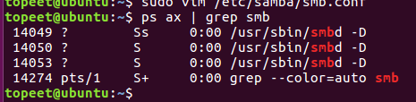
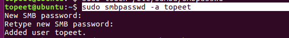
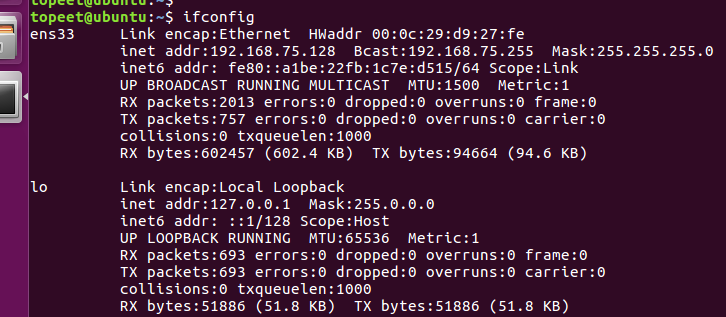
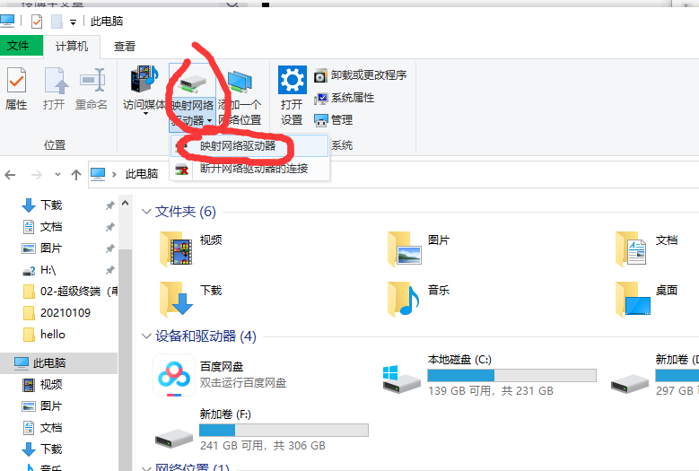
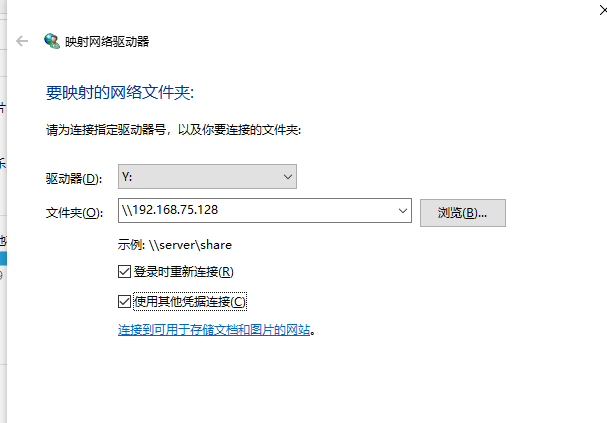
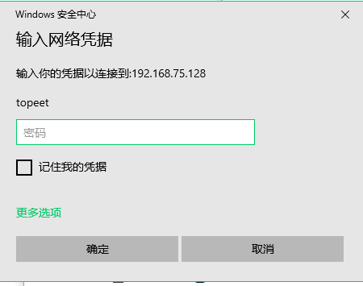

linux驱动环境搭建之一：安装samba服务

1.安装VMware和Ubuntu

- sudo apt-get install samba 

- 安装samba服务器（与电脑共享文件）
#apt-get remove samba     //卸载samba服务器  卸载时要注意    /etc/samba/smb.conf  配置文件还原成初始的样子

#apt-get install samba        //安装samba服务器

- ps ax | grep smb  

      出现了图中的这4个服务说明安装成功

- 添加用户和密码  输入两次密码

      sudo smbpasswd -a topeet   

- #vim /etc/samba/smb.conf //修改配置文件

在配置文件的后面增加

[myshare]
comment = ubuntu
path = /home/topeet/ybb/android
available = yes
writable = yes
valid user  =  topeet
public = yes
create mask = 0777
directory mask = 0777

- 注意  配置文件的后面不可以加中文注释

////////////////////////////////////////////////////注释//////////////////////////////////////////////

[myshare]       
comment = share folder      #内容介绍
security = share    #采用share登录机制
path = /home/jhxie/workspace  #访问路径
create mask = 0755      #创建文件时mask为0755
directory mask = 0755 #创建文件夹时mask为0755
writable = yes              #可对路径进行写操作
public = yes          #设置为公有
#admin users = root    #文件管理者
#valid users = root      #可访问者
#read only = yes   #只读

- 重启samba服务器：
sudo   /etc/init.d/samba restart

查看Ubuntu的IP
#ifconfig

PC端配置:
打开运行，输入Ubuntu的IP

按回车即可看到我们Ubuntu下共享的文件夹：

右键共享文件夹，选择映射网络驱动

点击完成

然后会在我的电脑下查看到一个网络映射的盘符

此时，Ubuntu的samba服务器即配置完成。把电脑中的文件拷贝到映射的盘符中即可在Ubuntu中查看。
若PC端访问不了，请把Ubuntu的防火墙和PC的防火墙关闭，然后重新映射即可。

3、samba安装常见错误：（这几种错误都是 配置文件中的内容，没配对，我是后面加了中文注释）
(1).重启samba失败
#/etc/init.d/samba restart
[....] Restarting smbd (via systemctl): smbd.serviceJob for smbd.service failed because the control process exited with error code. See "systemctl status smbd.service" and "journalctl -xe" for details.

解决方法
#testparm
Load smb config files from /etc/samba/smb.conf
rlimit_max: increasing rlimit_max (1024) to minimum Windows limit (16384)
WARNING: The "syslog" option is deprecated
Processing section "[printers]"
Processing section "[print$]"
Processing section "[myshare]"
Loaded services file OK.
WARNING: state directory /var/lib/samba should have permissions 0755 for browsing to work

WARNING: cache directory /var/cache/samba should have permissions 0755 for browsing to work

Server role: ROLE_STANDALONE

Press enter to see a dump of your service definitions 回车
….显示配置文件，缺认配置文件是否无误。

#smbd -F –S
invalid permissions on directory '/var/log/samba/cores': has 0777 should be 0700
Failed to create /var/log/samba/cores for user 0 with mode 0700
Unable to setup corepath for smbd: No such file or directory
smbd version 4.3.11-Ubuntu started.
Copyright Andrew Tridgell and the Samba Team 1992-2015
invalid permissions on directory '/var/lib/samba/private/msg.sock': has 0777 should be 0700
需要修改/var/log/samba/cores/ 与 /var/lib/samba/private/msg.sock/ 文件夹属性：
#chmod -R 0700 /var/log/samba/cores/
#chmod -R 0700 /var/lib/samba/private/msg.sock/
 #smbd -F –S
 smbd version 4.3.11-Ubuntu started.
Copyright Andrew Tridgell and the Samba Team 1992-2015
STATUS=daemon 'smbd' finished starting up and ready to serve connections 表示启动成功

（2） 和pc共享 

- ifconfig    

查看ip   我的IP   192.168.75.128

- 打开映射网络驱动器

- 输入 IP  记得加 勾选两框

- 输入密码  （这个密码为 上面执行这个sudo smbpasswd -a topeet  命令是输入的两次密码）

- 结束