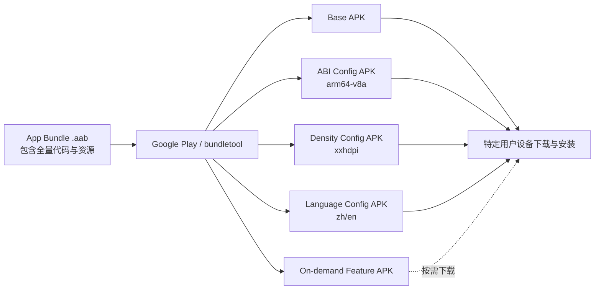
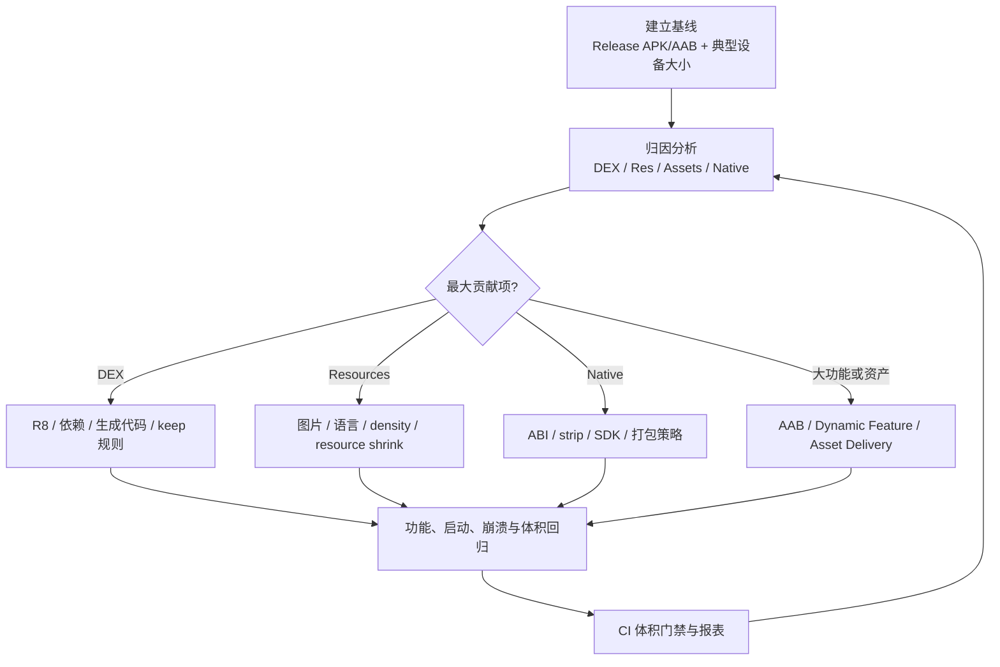
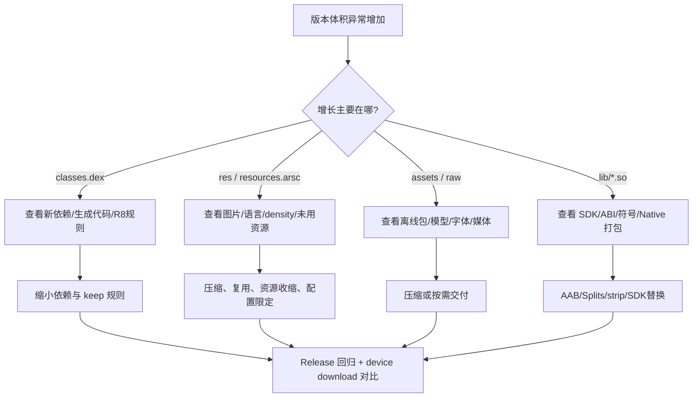

<a id="top"></a>

# Android 性能优化之 APK 瘦身详解

> 面向中高级 Android 开发者的工程化指南：从 APK/AAB 构成、体积归因、R8 与资源收缩，到 Native、图片、依赖、动态交付和持续治理。

> [!info] 文档基线
> 本文以 **Android Developers 官方文档截至 2026-05-31 的能力与推荐实践**为基线。特别注意：**AGP 8.12+ 引入 Optimized Resource Shrinking；AGP 9.0+ 在开启资源收缩后默认应用该优化；官方当前示例使用 `proguard-android-optimize.txt`。**

---

<a id="toc"></a>

## 目录

- [1. 为什么 APK 瘦身是性能优化](#why-size-matters)
- [2. 先建立正确的体积指标](#metrics)
- [3. APK 与 AAB 的文件构成](#apk-aab-structure)
- [4. 瘦身总体方法论](#methodology)
- [5. 工具链：定位体积问题](#toolchain)
- [6. 代码体积优化：R8、规则与依赖](#code-shrinking)
- [7. 资源体积优化：图片、语言、密度与资源收缩](#resource-shrinking)
- [8. Native `.so` 优化：ABI、符号与打包方式](#native-optimization)
- [9. 交付优化：AAB、配置 APK 与动态交付](#delivery)
- [10. 完整 Gradle 配置示例](#gradle-example)
- [11. 测量、回归与 CI 体积门禁](#measurement-ci)
- [12. 高频误区与故障排查](#pitfalls)
- [13. 优化优先级与落地 Checklist](#checklist)
- [14. 总结](#summary)
- [参考资料（Official）](#references)

---

<a id="why-size-matters"></a>

## 1. 为什么 APK 瘦身是性能优化

很多团队将“包体积”只理解为商店下载转化问题，但在 Android 工程中，体积往往同时影响：

| 维度 | 体积过大的代价 | 典型表现 |
| --- | --- | --- |
| 下载与转化 | 用户下载成本提高，弱网/流量受限场景更敏感 | 安装转化降低、更新率降低 |
| 安装与更新 | 需要传输、校验、解包或映射的数据更多 | 更新耗时增长、失败率上升 |
| 存储占用 | 安装文件、解包文件、缓存占用变大 | 低存储设备更容易卸载应用 |
| 启动与运行 | 未经优化的代码/资源常伴随更大的加载与内存压力 | 冷启动、渲染或 ANR 指标恶化 |
| 工程质量 | 冗余依赖、资源污染、错误 ABI 管理暴露架构问题 | 发布包持续膨胀，难以治理 |

> [!tip] 核心认知
> “APK 瘦身”不是单次删文件，而是**以真实交付体积为指标，通过归因、优化、回归和门禁形成闭环**。在使用 Google Play 分发时，更应关注设备实际下载到的 Split APK 组合，而非只看本地生成的 universal APK。

---

<a id="metrics"></a>

## 2. 先建立正确的体积指标

<a id="size-metric-comparison"></a>

### 2.1 四种“大小”不能混为一谈

| 指标 | 含义 | 适用场景 | 注意点 |
| --- | --- | --- | --- |
| APK 文件大小 | 本地单个 `.apk` 文件的字节数 | 侧载渠道、单 APK 对比 | 若为 fat/universal APK，不能代表 Play 用户下载量 |
| AAB 文件大小 | 上传到商店的 `.aab` 大小 | 发布制品审计 | AAB 不是用户可安装文件，也不是用户最终下载大小 |
| Compressed download size | 用户从 Play 下载的压缩传输体积 | 应用分发优化的核心指标 | 应按设备配置、模块组合测量 |
| Installed size | 安装后设备占用空间 | 存储体验、低端设备策略 | 与压缩下载大小不等价；`.so` / DEX 打包策略可能造成取舍 |

> [!warning] 不要只用 `app-release.apk` 大小判断 AAB 收益
> AAB 会由分发端按 ABI、density、language 等设备配置生成优化 APK。一个包含全部资源的 universal APK 常常显著大于单设备最终收到的 APK 组合。

<a id="optimization-targets"></a>

### 2.2 推荐的指标体系

建议为每个 release 版本记录以下指标：

| 指标 | 建议采集方式 | 目标 |
| --- | --- | --- |
| Base/Universal APK 大小 | APK Analyzer / `apkanalyzer` | 归因和快速对比 |
| 典型设备下载大小 | `bundletool get-size total` 或 Play Console | 用户真实下载体验 |
| `classes*.dex` 大小 | APK Analyzer / `apkanalyzer dex` | 代码与依赖治理 |
| `res/` + `resources.arsc` | APK Analyzer | 图片/语言/样式治理 |
| `lib/<abi>/*.so` | APK Analyzer / zip inspection | Native/ABI 治理 |
| 大文件 Top N | APK Analyzer | 优先处理 ROI 最高的对象 |
| 安装后占用 | 测试设备 / 自动化脚本 | 防止“下载变小、安装反增”的副作用 |

---

<a id="apk-aab-structure"></a>

## 3. APK 与 AAB 的文件构成

<a id="apk-structure"></a>

### 3.1 APK 的核心结构

APK 本质是一个 ZIP 归档。进行优化前，必须能够将体积归因到具体目录和文件：

| 路径 / 文件 | 内容 | 常见膨胀原因 | 主要手段 |
| --- | --- | --- | --- |
| `classes.dex`, `classes2.dex`... | Kotlin/Java 字节码及依赖转为 DEX 后的产物 | 依赖过重、反射 keep 过宽、生成代码膨胀 | R8、依赖裁剪、规则收敛 |
| `res/` | 图片、布局、raw 等资源 | 重复位图、多密度冗余、未压缩大文件 | WebP/Vector、资源复用、shrinkResources |
| `resources.arsc` | 编译后的 values/XML 资源索引 | 多语言字符串、多套主题/配置 | `resourceConfigurations`、资源治理 |
| `assets/` | 原样随包分发的资产 | 字体、模型、离线数据、网页资源过大 | 按需下载、压缩、拆模块 |
| `lib/<abi>/*.so` | JNI/NDK Native 库 | 多 ABI fat APK、符号未剥离、第三方 SDK | AAB/Splits、strip、依赖治理 |
| `META-INF/` | 签名与元数据 | 通常非主要矛盾 | 一般不作为优化主战场 |
| `AndroidManifest.xml` | 编译后的清单 | 体积很小 | 主要关注组件正确性而非体积 |

<a id="aab-structure"></a>

### 3.2 AAB 的价值：上传全量，用户只取所需

Android App Bundle (`.aab`) 是发布格式，不可直接安装。Google Play 会根据设备配置生成并交付 APK，例如：

- Base APK：应用基础功能；
- Feature APK：动态功能模块；
- Configuration APK：按 ABI、屏幕密度、语言等配置拆分；
- Asset Pack：适用于大规模资产交付场景。



> [!note] 结论
> 对 Play 分发应用，“减少 universal APK”与“减少某台设备实际下载”相关但不完全相同。AAB 能解决配置冗余交付问题，但并不会自动消除业务层冗余依赖、大图片或错误 keep 规则。

---

<a id="methodology"></a>

## 4. 瘦身总体方法论

<a id="optimization-closed-loop"></a>

### 4.1 闭环流程



<a id="optimization-order"></a>

### 4.2 建议执行顺序

| 优先级 | 行动 | 原因 |
| --- | --- | --- |
| P0 | 确认以 release + 正确渠道制品测量；启用 AAB 分发 | 避免指标和交付模型错误 |
| P1 | APK Analyzer 查找 Top 大文件与 DEX/Native/资源占比 | 低成本、高确定性 |
| P1 | release 开启 R8 + resource shrinking | 通常是基础能力，不应遗漏 |
| P1 | 图片格式、重复资源、无用资源与语言配置清理 | 常有直接、可观收益 |
| P1 | Native ABI 与第三方 `.so` 检查 | 含音视频/地图/AI SDK 时往往收益巨大 |
| P2 | 依赖替换、模块化、动态特性/资产按需交付 | 需要业务与架构配合 |
| P2 | CI 门禁、趋势跟踪、SDK 引入审计 | 将一次优化转为长期治理 |

---

<a id="toolchain"></a>

## 5. 工具链：定位体积问题

<a id="apk-analyzer"></a>

### 5.1 Android Studio APK Analyzer

APK Analyzer 可查看 APK/AAB 的文件树、下载大小估算、DEX 引用以及版本之间的差异。推荐固定流程：

1. 生成 release APK 或 AAB；
2. Android Studio 中选择 **Build > Analyze APK...**；
3. 按大小排序，识别 `lib/`、`res/`、`assets/`、`classes.dex` 的主要贡献；
4. 使用 **Compare with previous APK** 对比优化前后差异；
5. 将差异结论记录到发布报告。

<a id="apkanalyzer-cli"></a>

### 5.2 `apkanalyzer` 命令行

`apkanalyzer` 位于 Android SDK Command-Line Tools 中，路径通常为：

```bash
$ANDROID_SDK_ROOT/cmdline-tools/latest/bin/apkanalyzer
```

常用命令：

```bash
# 查看 APK 文件大小
apkanalyzer -h apk file-size app-release.apk

# 查看 APK 内文件并按大小寻找大户
apkanalyzer -h files list app-release.apk

# 打印清单信息
apkanalyzer manifest print app-release.apk

# 对比两个 APK 的差异
apkanalyzer -h apk compare --different-only old-release.apk new-release.apk

# 查看 DEX 包/类结构
apkanalyzer dex packages app-release.apk
```

| 命令关注点 | 用途 |
| --- | --- |
| `apk file-size` | 自动化记录 APK 字节数 |
| `apk compare` | 验证某个 PR 是否实际瘦身 |
| `files list` | 识别大图片、大资产、大 `.so` |
| `dex packages` | 发现某 SDK 或模块导致 DEX 膨胀 |

<a id="bundletool"></a>

### 5.3 `bundletool`：分析 AAB 的实际交付大小

AAB 场景不应只看 `.aab` 文件本身。`bundletool` 能模拟 Play 从 App Bundle 生成 APK Set：

```bash
# 1) 构建 release AAB
./gradlew :app:bundleRelease

# 2) 生成覆盖全部配置的 APK Set
bundletool build-apks \
  --bundle=app/build/outputs/bundle/release/app-release.aab \
  --output=app-release.apks \
  --overwrite

# 3) 使用连接设备导出 device spec
bundletool get-device-spec --output=device-spec.json

# 4) 为目标设备生成匹配 APK Set
bundletool build-apks \
  --bundle=app/build/outputs/bundle/release/app-release.aab \
  --output=app-device.apks \
  --device-spec=device-spec.json \
  --overwrite

# 5) 统计交付大小，可进一步结合模块/配置分析
bundletool get-size total --apks=app-device.apks
```

> [!tip] 测量策略
> 至少保留三类 device spec：主流 arm64 手机、中低密度/低存储设备、目标市场主要语言设备。体积优化若只在开发机配置上验证，可能遗漏语言、ABI 或模块组合导致的膨胀。

---

<a id="code-shrinking"></a>

## 6. 代码体积优化：R8、规则与依赖

<a id="r8-capabilities"></a>

### 6.1 R8 做什么

R8 是 Android 官方应用优化器，针对 release 包可执行：

| 能力 | 说明 | 对体积的作用 |
| --- | --- | --- |
| Code shrinking / Tree shaking | 基于可达性分析移除未使用类、字段、方法 | 删除 DEX 无效代码 |
| Optimization | 内联、类合并、程序重写等 | 减少指令/类结构开销，同时提升运行性能 |
| Obfuscation / Minification | 缩短类、字段、方法名 | 降低 DEX 符号体积 |
| Resource optimization | 与资源收缩协同处理资源引用 | 清理仅被无效代码引用的资源 |

<a id="enable-r8"></a>

### 6.2 release 开启 R8 与资源收缩

当前官方推荐在 release 中同时开启 `isMinifyEnabled` 和 `isShrinkResources`，并使用优化配置文件：

```kotlin
// app/build.gradle.kts
android {
    buildTypes {
        release {
            isMinifyEnabled = true
            isShrinkResources = true

            proguardFiles(
                getDefaultProguardFile("proguard-android-optimize.txt"),
                "proguard-rules.pro"
            )
        }
    }
}
```

<a id="r8-agp-version-table"></a>

### 6.3 AGP / R8 版本差异：必须掌握的变化

| AGP 版本 | 与 APK 瘦身相关的关键行为 | 工程建议 |
| --- | --- | --- |
| AGP 8.0+ | R8 full mode 默认启用 | 不要保留 `android.enableR8.fullMode=false` 作为长期配置 |
| AGP 8.12 / 8.13 | 支持 Optimized Resource Shrinking，但需手动开启 | 在 `gradle.properties` 添加 `android.r8.optimizedResourceShrinking=true` |
| AGP 9.0+ | 开启 `isShrinkResources = true` 时，Optimized Resource Shrinking 自动应用 | 无需额外属性；升级后重新测量体积与功能 |
| AGP 9.0+ | 官方说明不再支持 `getDefaultProguardFile("proguard-android.txt")` 的优化用途，因为其含 `-dontoptimize` | 使用 `proguard-android-optimize.txt` |
| AGP 9.1 | R8 默认重打包类以进一步压缩 DEX | 升级需验证反射、序列化、崩溃还原链路 |

对于 AGP 8.12 或 8.13：

```properties
# gradle.properties
android.r8.optimizedResourceShrinking=true
```

> [!warning] R8 规则不是“越多越安全”
> 广泛的 `-keep class ** { *; }` 会直接阻止收缩和优化。反射、JNI、序列化、WebView JS Bridge 等场景应以最小必要范围保留，并通过测试与 `mapping.txt` / retrace 验证。

<a id="keep-rule-principles"></a>

### 6.4 Keep Rule 设计原则

| 场景 | 错误写法倾向 | 优化做法 |
| --- | --- | --- |
| JSON 反射序列化 | 保留整个业务包 | 仅保留需要反射创建/读取字段的模型，优先改为代码生成序列化 |
| Retrofit/注解信息 | 全包 keep | 保留必要 attributes 与接口/模型，依据库官方 consumer rules 配置 |
| JNI 调用 | 保留所有 Native 相关代码 | 仅保留被 native 按类名/方法名查找的入口 |
| WebView JS Bridge | keep 所有 Activity | 保留标注了 `@JavascriptInterface` 的实际桥接方法 |
| SDK 接入失败 | 立即禁止优化 | 检查 SDK 文档和 missing rules，再新增最小 keep 规则 |

示例：限定反射模型范围而非全包保留：

```proguard
# 仅示意：实际规则需匹配你的序列化框架与模型范围
-keepattributes RuntimeVisibleAnnotations,AnnotationDefault,Signature
-keep class com.example.feature.payment.model.** { <fields>; }
```

<a id="dependency-governance"></a>

### 6.5 依赖与生成代码治理

DEX 膨胀通常不是业务代码本身导致，而是依赖选择或生成代码：

- 检查重复功能 SDK：多套图片加载、网络、JSON、统计或地图 SDK；
- 避免为极小功能引入重型依赖；
- 对 Google Play services 等组件采用按需依赖，而不是笼统引入大聚合包；
- 检查 protobuf、数据库、路由、DI 等生成代码产物；
- 优先选择具备良好 R8 consumer rules、支持模块化引入的依赖；
- 通过版本对比确认一次 SDK 升级实际增加了多少 DEX、Native 与资源体积。

```bash
# 查看依赖树，辅助追踪意外引入的模块
./gradlew :app:dependencies --configuration releaseRuntimeClasspath
```

---

<a id="resource-shrinking"></a>

## 7. 资源体积优化：图片、语言、密度与资源收缩

<a id="resource-reduction-strategy"></a>

### 7.1 资源优化分类

| 类型 | 常见问题 | 首选优化手段 |
| --- | --- | --- |
| 未引用资源 | 删除功能后图片/XML 仍存留 | Lint + `isShrinkResources` + 人工确认 |
| 多语言资源 | 引入库携带大量不支持语言 | `resourceConfigurations` 或 AAB 语言拆分 |
| 多密度位图 | 每个 density 都包含大图 | 矢量、WebP、合理保留 density、AAB density split |
| 重复视觉变体 | 同一图标多色、多旋转版本 | `tint`、`rotate`、运行时绘制 |
| 动画资源 | 帧动画携带大量 bitmap | AnimatedVectorDrawable / 动画方案重构 |
| `assets/` 大文件 | Lint/resource shrink 不处理或不充分处理 | 手工审计、压缩、按需交付 |

<a id="unused-resources"></a>

### 7.2 无用资源：Lint 与 Resource Shrinker 的边界

Android Lint 可以报告 `res/` 中可能未被引用的资源，但应明确其边界：

- Lint 负责发现，**不会自动删除**；
- `assets/` 不在普通未使用资源检测的可靠覆盖范围内；
- 动态资源名、反射、资源 ID 拼接或库内部引用可能引发误判；
- `isShrinkResources = true` 依赖代码收缩同时开启；代码不可达后，相关资源才更容易被移除。

```bash
# 运行 lint，定位潜在未使用资源
./gradlew :app:lintRelease
```

<a id="resource-configurations"></a>

### 7.3 限定支持语言资源

对于仅支持少量语言的应用，可避免库中未使用语言进入 APK：

```kotlin
// app/build.gradle.kts
android {
    defaultConfig {
        // 仅在产品确实只支持这些语言时使用
        resourceConfigurations += listOf("zh", "en", "ja")
    }
}
```

> [!warning] 国际化风险
> `resourceConfigurations` 会移除未声明的替代资源。先与产品支持语言、服务端下发语言策略、系统语言回退行为对齐，再启用此优化。

<a id="image-format-selection"></a>

### 7.4 图片格式与矢量选择

| 资源类型 | 推荐方案 | 优势 | 风险 / 不适用场景 |
| --- | --- | --- | --- |
| 简单图标、单色图形 | `VectorDrawable` | 单份资源适配多密度，体积小 | 大型复杂矢量可能增加渲染开销 |
| 照片/复杂位图 | WebP（按画质验证） | 相比 PNG/JPEG 可获得更优压缩 | 要做视觉回归，尤其渐变、文字、透明边缘 |
| 形状、边框、渐变背景 | XML `<shape>` Drawable | 文件极小，可主题化 | 高度复杂图形不适合 |
| 颜色变化图标 | 一份资源 + `tint` | 消除重复 bitmap | 设计稿需支持 tint 行为 |
| 简单旋转变体 | `<rotate>` 或代码旋转 | 不重复存储图片 | 仅适用于可变换复用的素材 |
| 逐帧动画 | Animated Vector / 其他矢量动画 | 避免大量帧 bitmap | 复杂动效需权衡实现成本与渲染性能 |

XML 资源复用示例：

```xml
<?xml version="1.0" encoding="utf-8"?>
<rotate xmlns:android="http://schemas.android.com/apk/res/android"
    android:drawable="@drawable/ic_thumb_up"
    android:pivotX="50%"
    android:pivotY="50%"
    android:fromDegrees="180" />
```

<a id="assets-raw-fonts"></a>

### 7.5 `assets/`、`raw/`、字体与离线内容

这类内容常被忽略，因为它们可能不会被常规资源收缩显著处理：

- 字体：避免随包携带多套未使用字重；可评估可下载字体或字体子集策略；
- 离线 HTML/前端包：开启资源压缩、移除 sourcemap 与开发产物；
- 词典、地图、模型、音视频：按业务需要拆到按需下载或资产交付；
- 配置文件：清理测试数据、mock、样例资产、重复协议文件；
- 安全注意：不要以“瘦身”为由删除运行时或合规必须资产。

---

<a id="native-optimization"></a>

## 8. Native `.so` 优化：ABI、符号与打包方式

<a id="native-size-root-causes"></a>

### 8.1 Native 体积为何容易成为最大头

音视频、图片处理、地图、实时通信、加密、游戏引擎和 AI SDK 常携带 `.so`。若一个 APK 同时包含多个 ABI，形态类似：

```text
lib/armeabi-v7a/libfeature.so
lib/arm64-v8a/libfeature.so
lib/x86/libfeature.so
lib/x86_64/libfeature.so
```

这就是 fat APK：兼容面广，但同一功能的机器码被重复打包给单一设备下载。

<a id="abi-strategy"></a>

### 8.2 ABI 策略对比

| 方案 | 优点 | 缺点 | 推荐场景 |
| --- | --- | --- | --- |
| 单个 fat APK 包含全部 ABI | 分发简单、侧载兼容范围广 | 用户下载大量不需要的 `.so` | 极少数必须单包覆盖多架构的渠道 |
| APK Splits 按 ABI 输出 | 非 Play 渠道也可降低单设备包大小 | 版本与渠道管理复杂 | 自建渠道/企业分发 |
| AAB + Play 配置 APK | 自动按设备交付匹配 ABI，维护成本低 | 依赖支持 AAB 的分发渠道 | Google Play 首选方案 |
| 仅保留特定 ABI | 体积显著减少 | 会失去未支持架构设备兼容性 | 有明确设备约束的私有/专用应用 |

> [!caution] 不要凭经验随意删 ABI
> ABI 覆盖是兼容性决策，不只是体积决策。应以真实设备范围、渠道规则、第三方 SDK 支持矩阵和发布政策为依据。

<a id="strip-symbols"></a>

### 8.3 去除发布包调试符号

Release `.so` 不应无意中携带大体积调试符号。可通过 NDK strip 或构建系统配置减少发布制品中的符号内容，同时将符号文件作为崩溃解析制品单独保存。

建议发布链路保留：

- Release APK/AAB；
- Native symbols / mapping 制品；
- 对应版本号、commit SHA 与上传记录；
- Native 崩溃回溯的符号化验证。

<a id="native-packaging"></a>

### 8.4 Native 库打包方式：避免简单比较 ZIP 大小

官方指南指出，在 release 构建中可将 `.so` 以不压缩形式封装，并通过 `useLegacyPackaging = false` 避免安装时复制 native library：

```kotlin
// app/build.gradle.kts
android {
    packaging {
        jniLibs {
            useLegacyPackaging = false
        }
    }
}
```

需要理解的是：

- APK 文件的 ZIP 表观大小可能因“不压缩”而变化；
- 但避免安装时再次提取/复制 `.so`，可能改善安装占用、更新与加载体验；
- 因此，应同时测量 **download size** 与 **installed size**，不能仅以压缩包字节数下结论。

---

<a id="delivery"></a>

## 9. 交付优化：AAB、配置 APK 与动态交付

<a id="aab-delivery"></a>

### 9.1 AAB 为何通常是首选

使用 AAB 发布后，Google Play 可按目标设备仅下发必要的：

- ABI native libraries；
- screen density 资源；
- language 资源；
- 动态功能模块与对应配置资源。

这意味着：即使源工程需要支持多个国家、多套设备和多种架构，单个用户也不必下载全部配置资源。

<a id="dynamic-delivery"></a>

### 9.2 Dynamic Feature / Asset Delivery 的适用判断

| 能力 | 适合拆出的内容 | 不适合盲目拆出的内容 |
| --- | --- | --- |
| Play Feature Delivery | 低频、可延后使用的完整业务功能，例如专业编辑器、某类入口工具 | 首屏、登录、核心支付流程等强依赖基础体验的功能 |
| Play Asset Delivery | 大型游戏资产、高清材质、可按需加载素材 | 业务 App 中大量细碎的核心 UI 资源 |
| Install-time module | 首次安装必须存在但适合独立模块管理的内容 | 不能减少首次下载体积的模块拆分幻想 |
| On-demand module | 使用率低、用户触发后才需要的模块 | 无网络仍必须可用的核心功能 |

> [!tip] 架构判断
> 模块化能够改变“谁在什么时候下载什么”，但不能替代基础治理：一个动态模块内部仍然需要 R8、资源治理和依赖控制。

<a id="side-loading"></a>

### 9.3 非 Play 渠道怎么办

若发布渠道不支持 App Bundle 的按设备服务，可考虑：

- 按 ABI 输出多个 APK；
- 对高体积资源采用业务侧按需下载；
- 严格维护 APK 与设备兼容映射；
- 使用相同分析与 CI 门禁机制，避免单渠道包无限膨胀。

---

<a id="gradle-example"></a>

## 10. 完整 Gradle 配置示例

<a id="api-config-table"></a>

### 10.1 APK 瘦身关键配置参数表

| 配置项 | 位置 | 作用 | 适用条件 / 注意事项 |
| --- | --- | --- | --- |
| `isMinifyEnabled = true` | `buildTypes.release` | 启用 R8 代码收缩、优化、混淆 | 建议 release 开启；必须验证反射/JNI/序列化 |
| `isShrinkResources = true` | `buildTypes.release` | 删除不可达资源 | 依赖代码收缩启用；需验证动态资源引用 |
| `getDefaultProguardFile("proguard-android-optimize.txt")` | `proguardFiles` | 使用官方默认优化规则 | 当前官方建议；避免旧的非优化配置 |
| `android.r8.optimizedResourceShrinking=true` | `gradle.properties` | 开启优化资源收缩 pipeline | AGP 8.12 / 8.13 手动开启；AGP 9.0+ 通常无需手动设置 |
| `resourceConfigurations += listOf(...)` | `defaultConfig` | 仅保留支持的语言/配置资源 | 与实际产品语言能力一致 |
| `packaging.jniLibs.useLegacyPackaging = false` | `android.packaging` | 避免安装时提取/复制 `.so` 的旧行为 | 同时测量下载和安装大小 |
| `abiFilters` | `ndk` | 限定构建包含的 ABI | 只在兼容范围明确时使用；Play 分发优先评估 AAB |

<a id="complete-config"></a>

### 10.2 Kotlin DSL 配置案例

```kotlin
// app/build.gradle.kts
android {
    defaultConfig {
        // 示例：仅在产品明确只支持以下语言时开启
        resourceConfigurations += listOf("zh", "en", "ja")

        // 示例：私有设备或非 Play 精准发行才考虑限定 ABI；
        // 面向广泛 Play 用户通常优先使用 AAB 的 ABI 配置交付。
        // ndk {
        //     abiFilters += listOf("arm64-v8a", "armeabi-v7a")
        // }
    }

    buildTypes {
        release {
            isMinifyEnabled = true
            isShrinkResources = true

            proguardFiles(
                getDefaultProguardFile("proguard-android-optimize.txt"),
                "proguard-rules.pro"
            )
        }
    }

    packaging {
        jniLibs {
            // 避免 legacy 提取行为；基于你的 minSdk/AGP/发布场景回归验证
            useLegacyPackaging = false
        }
    }
}
```

对于使用 **AGP 8.12 或 AGP 8.13** 的工程，再添加：

```properties
# gradle.properties
android.r8.optimizedResourceShrinking=true
```

<a id="proguard-example"></a>

### 10.3 `proguard-rules.pro` 维护思路示例

```proguard
# 不要从全局 keep 开始；先依赖库自身 consumer rules，
# 仅针对真实失败的动态访问入口补充最小规则。

# 示例：保留被 WebView Javascript 反射暴露的方法注解
-keepclassmembers class * {
    @android.webkit.JavascriptInterface <methods>;
}

# 示例：JNI 根据名称访问的指定入口（请换成实际类名）
-keepclasseswithmembernames class com.example.nativebridge.NativeBridge {
    native <methods>;
}

# 示例：保留通用注解/签名信息，具体按库文档调整
-keepattributes RuntimeVisibleAnnotations,AnnotationDefault,Signature,InnerClasses,EnclosingMethod
```

> [!warning] 规则必须以测试结果为依据
> 本节规则为设计模式示意，并非对所有序列化框架、网络库或 SDK 的通用复制模板。最终规则应依据依赖官方说明、release 自动化测试、崩溃日志与 R8 输出文件收敛。

---

<a id="measurement-ci"></a>

## 11. 测量、回归与 CI 体积门禁

<a id="verification-procedure"></a>

### 11.1 每次优化的验证顺序

| 步骤 | 检查项 | 成功标准 |
| --- | --- | --- |
| 1. 建立基线 | 原始 release APK/AAB、设备下载大小、安装占用 | 数据可复现，制品可追踪 |
| 2. 单变量优化 | 一次只合并一类瘦身改动 | 明确体积收益来源 |
| 3. 文件差异分析 | DEX、资源、Native、大资产差值 | 与预期改动一致，无异常丢失 |
| 4. 功能回归 | 登录、深链、反射解析、动态功能、JNI、离线资源 | Release 构建通过自动化/人工核心路径 |
| 5. 性能回归 | 启动、内存、渲染、崩溃、ANR | 无不可接受回退 |
| 6. 分发验证 | AAB 对典型设备的下载大小 | 用户真实交付体积下降 |
| 7. 门禁入库 | 报告、阈值、异常审批 | 后续版本不会静默反弹 |

<a id="size-budget"></a>

### 11.2 体积 Budget 建议

可为项目设置体积预算，例如：

```yaml
# size-budget.yml（概念示例）
release:
  max_download_size_arm64_zh_xxhdpi_mb: 45
  max_apk_growth_per_pr_kb: 300
  max_native_growth_per_pr_kb: 100
  max_dex_growth_per_pr_kb: 120
  review_required_when_exceeded: true
```

建议在 CI 中生成报表，至少输出：

```text
Total APK / estimated device download delta
DEX delta by package
Native .so delta by ABI and library
Resource/assets top growth files
Threshold result: PASS / REVIEW / FAIL
```

<a id="ci-command-example"></a>

### 11.3 CI 命令流程示例

```bash
set -euo pipefail

# 构建优化后的发布制品
./gradlew :app:assembleRelease :app:bundleRelease

# APK 快速指标
apkanalyzer -h apk file-size app/build/outputs/apk/release/app-release.apk

# AAB -> 典型设备 APK Set
bundletool build-apks \
  --bundle=app/build/outputs/bundle/release/app-release.aab \
  --output=build/size/app-device.apks \
  --device-spec=ci/device-spec-arm64-xxhdpi-zh.json \
  --overwrite

# 估算特定设备交付大小
bundletool get-size total --apks=build/size/app-device.apks
```

---

<a id="pitfalls"></a>

## 12. 高频误区与故障排查

<a id="pitfall-table"></a>

### 12.1 常见误区对照表

| 误区 | 为什么错 | 正确处理 |
| --- | --- | --- |
| AAB 文件小了，用户下载一定小了 | AAB 只是发布制品，实际下载受设备配置和模块影响 | 用 `bundletool` / Play Console 对目标设备测量 |
| 只开 `shrinkResources` 不开 R8 | 资源可达性与代码可达性关联，官方要求配合代码收缩 | release 同时开启两者 |
| 为了不崩溃直接 keep 整个包 | 会阻断大量优化，体积反弹 | 基于失败点收敛到最小规则 |
| APK ZIP 更小就代表更优 | 压缩、解包与安装占用可能有权衡 | 同时评估下载大小、安装大小、启动表现 |
| 删掉 `x86` 或 32 位 ABI 就万事大吉 | 可能破坏渠道、设备或测试兼容 | 先确认用户设备与发布策略，优先采用配置交付 |
| 图片全换 Vector 一定更优 | 大型复杂矢量可能渲染更慢 | 图标/简单形状用 Vector，复杂图片用压缩位图并验证 |
| `assets/` 会被资源收缩自动清空 | 常规资源检测/收缩并不能可靠治理任意资产 | 手工审计与按需交付治理 |

<a id="r8-troubleshooting"></a>

### 12.2 开启 R8 后崩溃如何排查

1. 确认问题只在 release/开启优化的构建发生；
2. 查看丢失类/反射/JNI/序列化相关报错；
3. 检查依赖提供的 consumer ProGuard/R8 rules 是否生效；
4. 使用最小 `-keep` 补齐动态访问入口；
5. 保存 `mapping.txt`，通过 retrace 或 Android Studio 日志还原混淆栈；
6. 对优化前后 APK 做差异分析，确认是否错误移除了必须资源或类；
7. 将该路径加入 release 自动化回归用例。

<a id="resource-troubleshooting"></a>

### 12.3 开启资源收缩后资源找不到

常见原因：

- 通过字符串拼接调用 `getIdentifier()`；
- Web/脚本/远程配置动态指定资源名；
- 反射或插件式加载；
- 业务按约定访问 `assets/` 文件，但优化时手动误删；
- 限定 `resourceConfigurations` 后，系统语言回退未覆盖。

处理原则：对于确实会动态访问的资源，应以明确约定和最小保留机制修复，而不是关闭整套资源收缩。

---

<a id="checklist"></a>

## 13. 优化优先级与落地 Checklist

<a id="fast-wins"></a>

### 13.1 一周内可落地的高 ROI 项

- [ ] 对 release APK/AAB 建立初始体积分解基线；
- [ ] 开启/核查 R8 `isMinifyEnabled = true`；
- [ ] 开启/核查 `isShrinkResources = true`；
- [ ] 使用 `proguard-android-optimize.txt` 并检查过宽 keep 规则；
- [ ] 若为 AGP 8.12/8.13，启用 Optimized Resource Shrinking；
- [ ] 使用 APK Analyzer 识别 Top 20 大文件；
- [ ] 将明显 PNG/JPEG 大图评估迁移为 WebP；
- [ ] 检查无用语言、重复资源、帧动画与大 `assets/`；
- [ ] 检查 `lib/` 下 ABI 与第三方 `.so` 占比；
- [ ] 使用 `bundletool` 测量至少一台目标设备实际下载大小。

<a id="release-checklist"></a>

### 13.2 发布前 Checklist

- [ ] 使用 release 而非 debug 制品测量；
- [ ] APK/AAB、mapping、native symbols 与体积报表已归档；
- [ ] R8 后反射、序列化、JNI、WebView Bridge、深链、推送入口已回归；
- [ ] 典型设备 AAB 下载体积未超过预算；
- [ ] 新增 SDK 已给出 DEX/Native/资源增量说明；
- [ ] 图片与资产变更无明显视觉退化；
- [ ] 安装后占用和关键性能指标未发生不可接受回退；
- [ ] 体积门禁失败已获得明确评审结论，而非静默忽略。

<a id="decision-tree"></a>

### 13.3 体积异常的快速决策树



---

<a id="summary"></a>

## 14. 总结

APK 瘦身的本质，是减少用户设备实际不需要下载、安装或加载的代码与资源，并用工程机制防止体积再次失控：

1. **度量正确**：区分 APK、AAB、下载大小与安装大小；AAB 应按设备交付结果评估。
2. **先用官方基础能力**：release 开启 R8 与资源收缩；结合当前 AGP 版本使用 Optimized Resource Shrinking。
3. **按贡献项治理**：DEX 看依赖与 keep，资源看图片/语言/动态引用，Native 看 ABI 与 `.so`，大内容看模块化与按需交付。
4. **避免局部最优**：压缩包更小并不必然代表安装体验、启动性能或兼容性更好。
5. **建立持续门禁**：每个版本报告大小增量、关联变更、设备下载指标和回归结论。

> [!info] 最小可行落地方案
> 对绝大多数 Android 应用，第一阶段即可执行：**AAB 分发 + release R8/资源收缩 + APK Analyzer 归因 + 图片/依赖/Native Top 项治理 + bundletool 实际下载测量 + CI 增量门禁**。

[返回目录](#toc) · [返回顶部](#top)

---

<a id="references"></a>

## 参考资料（Official）

> 以下链接用于核对当前工具行为、配置方式和版本差异；访问时间：2026-05-31。

1. Android Developers, **Reduce your app size**  
   <https://developer.android.com/topic/performance/reduce-apk-size>
2. Android Developers, **Enable app optimization with R8**  
   <https://developer.android.com/topic/performance/app-optimization/enable-app-optimization>
3. Android Developers, **apkanalyzer**  
   <https://developer.android.com/tools/apkanalyzer>
4. Android Developers, **bundletool**  
   <https://developer.android.com/tools/bundletool>
5. Android Developers, **About Android App Bundles**  
   <https://developer.android.com/guide/app-bundle>
6. Android Developers, **The Android App Bundle format**  
   <https://developer.android.com/guide/app-bundle/app-bundle-format>
7. Android Developers, **Build and test your Android App Bundle**  
   <https://developer.android.com/guide/app-bundle/test>
8. Android Developers, **Android ABIs (NDK)**  
   <https://developer.android.com/ndk/guides/abis>

---

<a id="appendix-a"></a>

## 附录 A：审计记录模板

```markdown
# APK Size Audit - vX.Y.Z

## 制品
- Commit SHA:
- AGP version:
- minSdk / targetSdk:
- Release APK:
- Release AAB:
- Device specs used:

## 指标对比
| Metric | Previous | Current | Delta | Conclusion |
| --- | ---: | ---: | ---: | --- |
| arm64/zh/xxhdpi download size | | | | |
| Universal APK | | | | |
| DEX total | | | | |
| Native total | | | | |
| Resources total | | | | |

## Top Growth Files / Packages
| Rank | File or Package | Delta | Introduced by | Action |
| ---: | --- | ---: | --- | --- |
| 1 | | | | |

## 回归结果
- Core functional tests:
- R8-sensitive paths:
- Native/JNI tests:
- Startup/performance check:
- Visual resource check:

## 结论
- Budget: PASS / REVIEW / FAIL
- Follow-up actions:
```

<a id="appendix-b"></a>

## 附录 B：适合知识库维护的命名锚点约定

本文所有一级或二级主题使用显式 HTML 锚点：

```html
<a id="native-optimization"></a>
## Native `.so` 优化
```

目录引用方式：

```markdown
- [Native `.so` 优化](#native-optimization)
```

建议锚点命名规则：

- 使用英文小写与短横线：`resource-shrinking`；
- 一个文档内唯一；
- 不依赖渲染器自动生成的中文标题锚点；
- 适合 Obsidian、GitHub、MkDocs 等环境迁移与维护。

[返回目录](#toc) · [返回顶部](#top)
