# Android ClassyShark vs ApkTool

引子

作为程序员，借鉴可能是工作中所必须碰到的事情，程序员的世界里，更多的不是从无到有，而是从有到优。那么当我们在做一些需求或者架构调整时，可能需要参考别的成熟公司的做法，例如淘宝，美团，蘑菇街等。

那么怎么来查看别人的apk架构以及源码实现。没错，反编译！那么在ClassyShark出来之前，我们可能都是用的apktool，现在我们来对比下这两个工具之间的优劣对比。

我们以淘宝apk为例，分别用这两个工具进行解析。(基于mac系统)

两者PK

一.用ClassyShark解析淘宝apk

1.下载地址

2.运行命令

java -jar ClassyShark.jar

弹出如下界面：

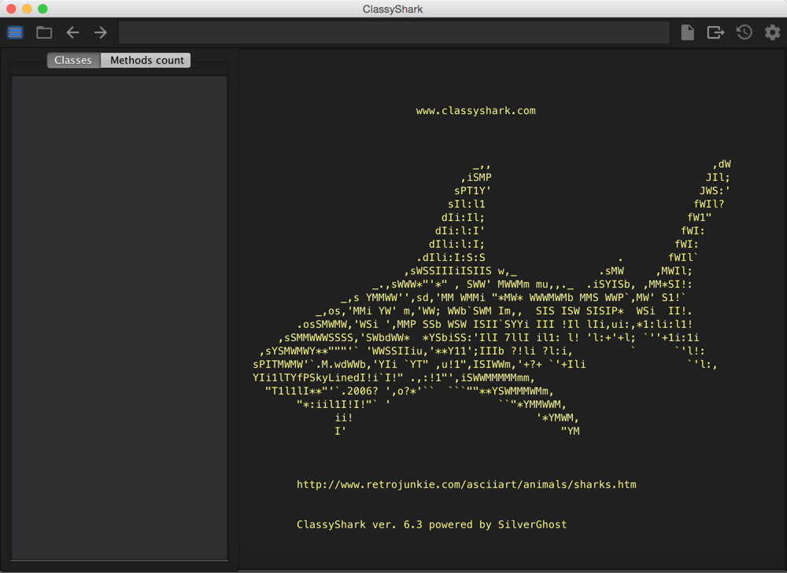

ClassyShark界面

3.打开淘宝apk，如图：

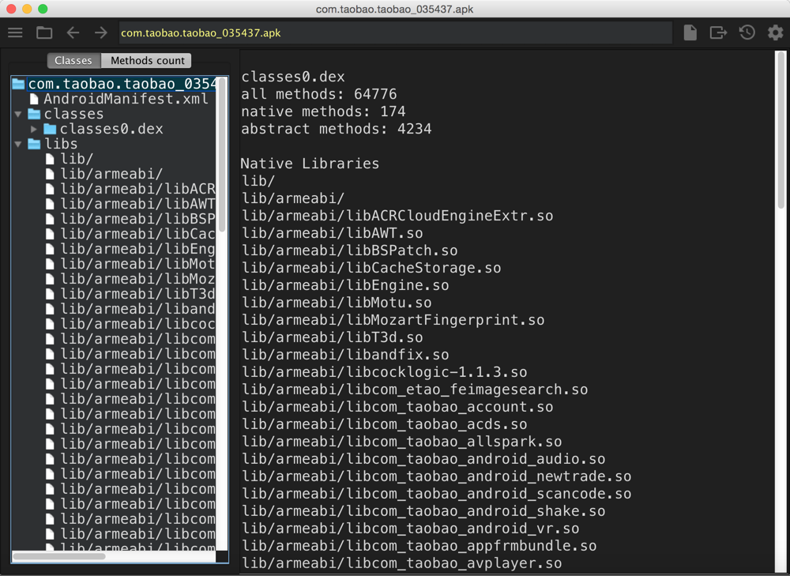

淘宝apk结构

分析上图，左边目录栏中主要显示了三部分内容，manifest文件，classes.dex文件集（为什么说是文件集，因为当apk开发采用Mutidex时会产生多个dex文件，不知淘宝为何没有采用Mutidex）和so引用集。

4.查看淘宝manifest文件，如下图：

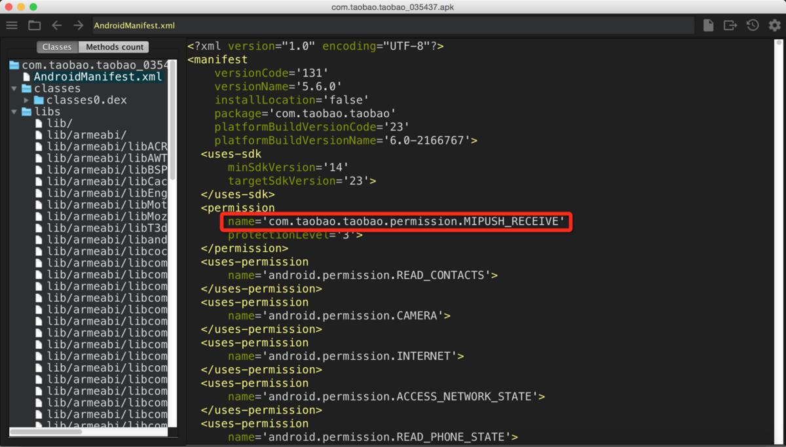

淘宝manifest文件

在决定采用那种第三方支持，例如推送时，我们常常会参考别的一些成熟公司，上图红框中可以明显看出是小米推送的相关权限声明，从这可以了解淘宝也是引入了小米推送的。

5.查看class文件的源码

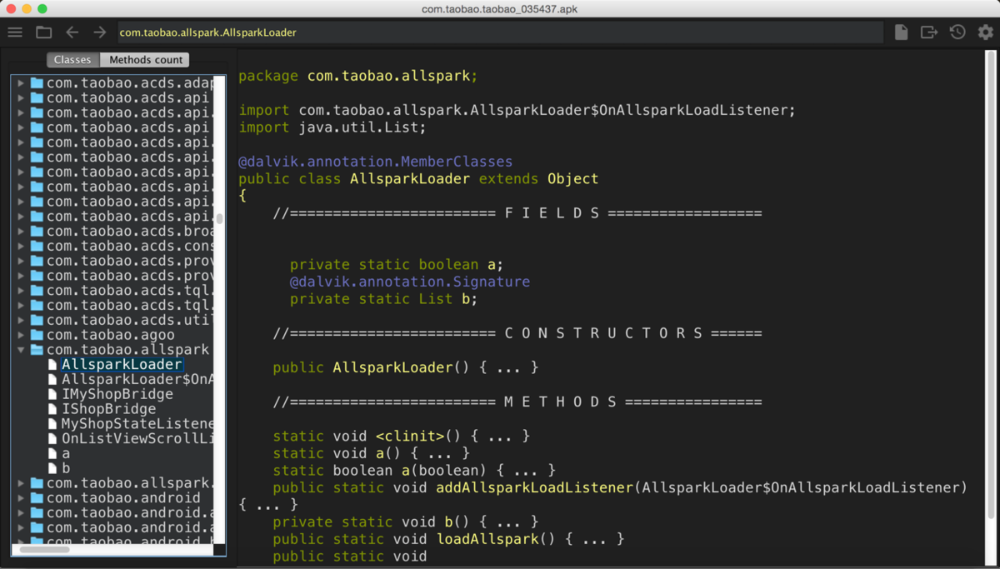

AllsparkLoader类源码

上图可以看出ClassyShark工具将类的相关方法和变量声明进行了结构调整，分为三部分显示fields,constructors,methods。结构会更清晰，但是也不难发现源码基本都是省略号（看来只能看类基本的组成而已- -）。另外有个小技巧，双击对应的变量对象可以快速跳转至该对象class文件。

6.图形化查看整个apk的构成（这也是我最喜欢的功能）

将右边的目录栏tab切换成Methods count，如下图：

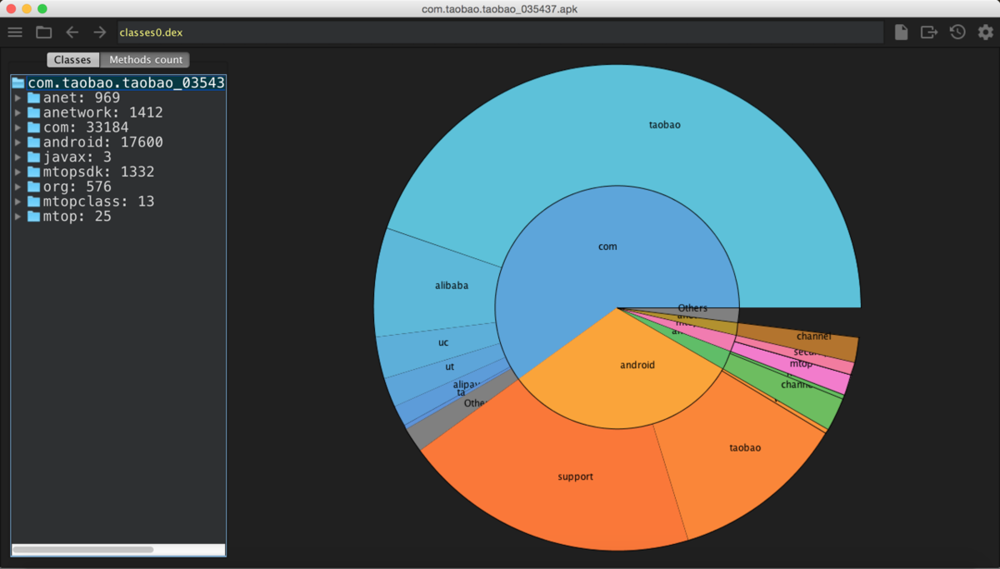

apk的构成饼图

有时候我们可能只想了解别人的架构，相关组成部分的占比权重，上图能很清晰的表现出来。如果我们想了解占比最高的taobao api部分的组成时，只需在图上点击相应部分。

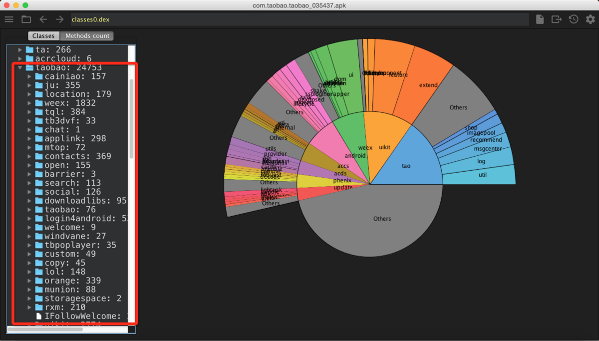

Paste_Image.png

我们看到了其中有阿里最近开源出来的react库weex（声称比rn好用）。当然如果你想更详细的查看就在右边目录中挨个找，图形只是一个总体浏览。

7.使用总结

总的来说ClassyShark的使用非常便捷，只需一个命令行，然后打开对应的apk即可，而且显示的内容非常有条理，非常适合在对别人apk整体架构借鉴时使用。

二.用ApkTool解析淘宝apk

用apktool反编译还需要另外一些工具集：

- apktool （用于获取资源文件）

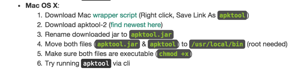

apktool安装图解

按上图进行安装

- dex2jar （获取源文件jar包）

- JD-GUI （反编译源文件jar包查看源代码）

完成以上工具集的下载安装后，就可以开工了。

1.用apktool解析apk资源

apktool d xxx.apk

在终端运行以上命令，效果如下图：

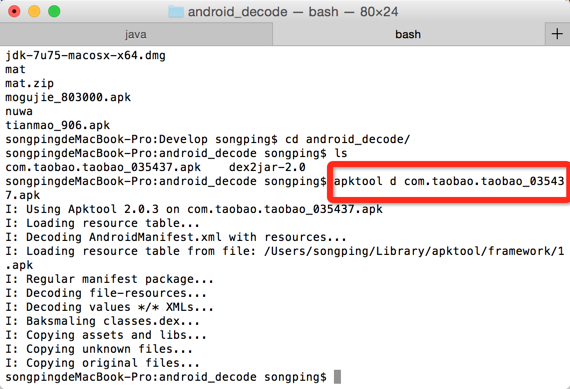

apktool解析apk资源文件

那么运行完命令后会产生一个文件夹，对应的内容为以下：

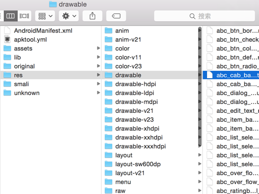

apktool反编译产生的资源文件夹

可以看到apktool反编译后，能直接拿到apk中的资源文件，如drawable之类，但是ClassyShark并不能。（记得以前在学校做app时还经常去其他app上抠图用，就是用这个方法....）

到这里我们还不能够看到对应的源码，要看源码还需要以下几步。

2.dex2jar获取源文件jar包

首先将你的apk文件改为zip文件格式，然后解压出来，其中会有一个classes.dex文件，接下来我们就是从这个文件中获取源文件。将classes.dex文件拷贝到你的dex2jar文件夹下，如下图：

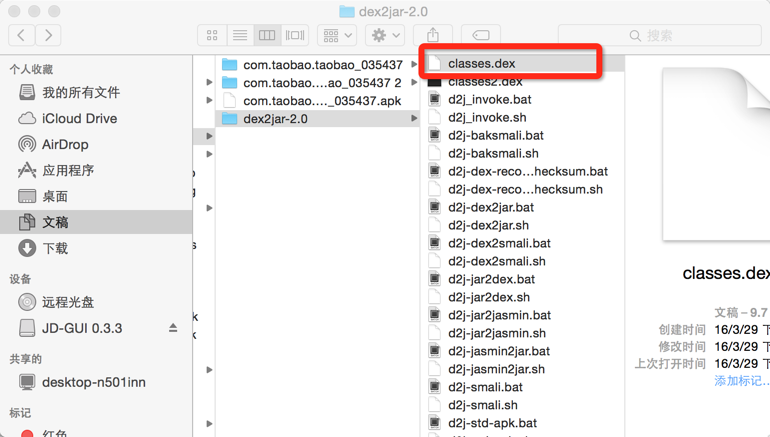

classes.dex拷贝至dex2jar

为了解决一个mac下permission的问题需要先运行以下命令

sudo chmod 777 d2j-jar2dex.sh

之后就可以进行获取jar包，运行以下命令：

./d2j-dex2jar.sh classes.dex

最终在dex2jar文件夹下得到源文件的jar包classes-dex2jar.jar文件。我们就差最后一步，将jar包反编译获取java文件。

3.JD-GUI获取java源文件

用jd-gui工具打开对应classes-dex2jar.jar文件,结果如下图：

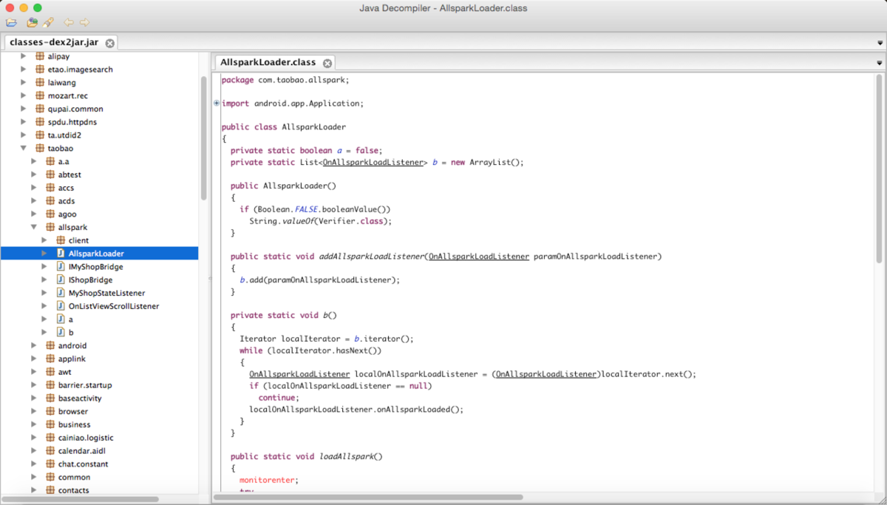

AllsparkLoader类源码

这里特意截取了之前用ClassyShark解析过的AllsparkLoader类，通过对比，我们不难发现，虽然也不能解析出混淆后的变量名，但是内容会比ClassyShark更加详细，可以看出一些代码逻辑。

对比两者的优缺点

ClassyShark：

优点：

1.使用非常便捷，只需一个命令行唤起界面即可。

2.源码目录结构清晰，并且可以通过图形化查看整个apk的组成架构

缺点：

1.源码过于简略，不能获取相应代码逻辑

2.不能获取到资源文件

ApkTool：

优点：

1.可以获取较完整的资源文件集

2.源码较为详细

缺点：

1.使用较为复杂，需要多个工具结合

2.不能较好查看整个apk的架构逻辑

总结

ClassyShark，ApkTool两者各有优劣，开发者在开发过程中可以根据实际需求斟酌使用，当然有些时候两者配合使用说不定会更好哦~