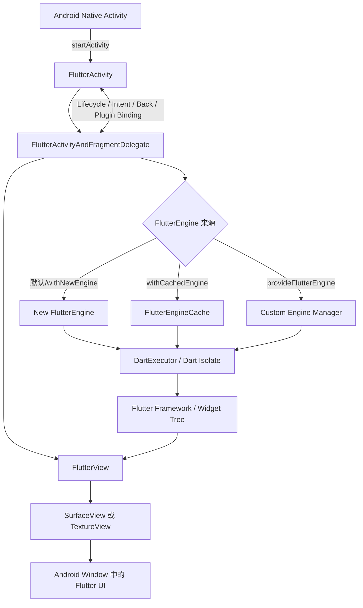
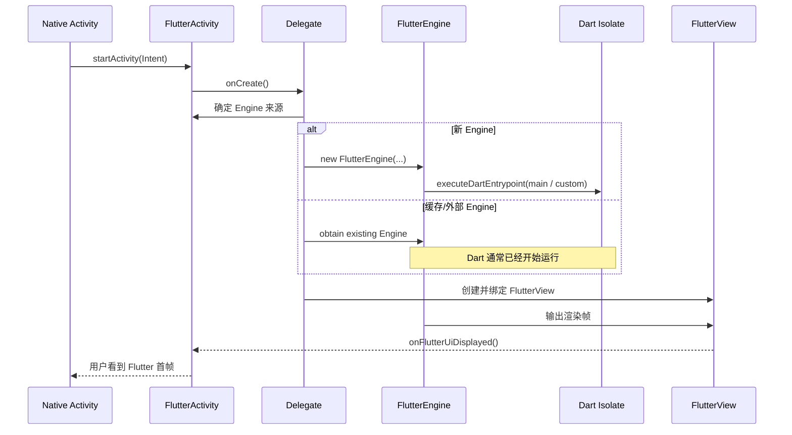
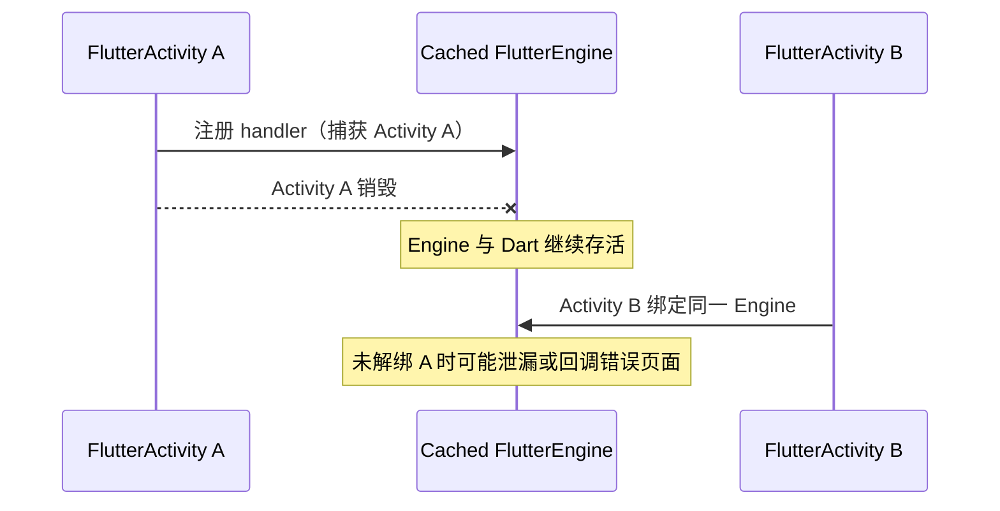
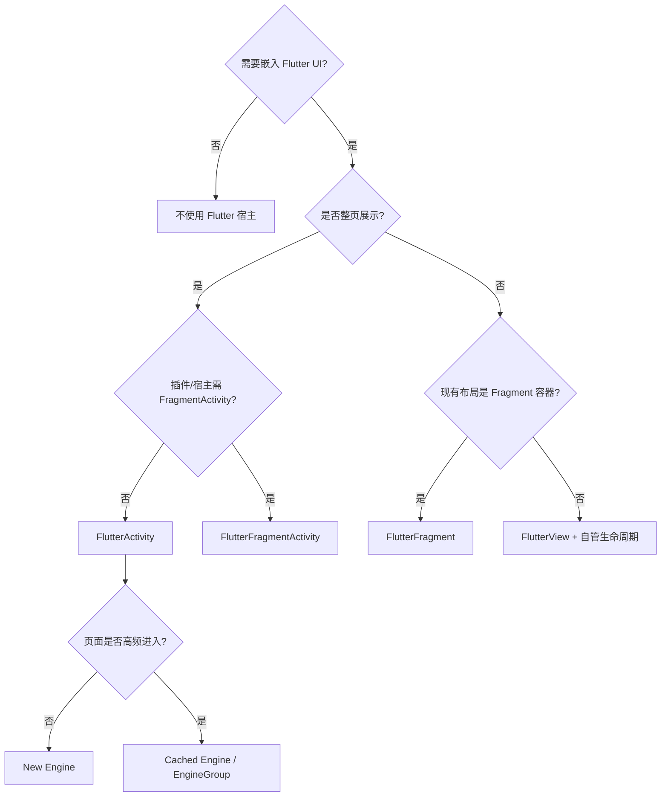

<a id="top"></a>

# FlutterActivity 详解：Android 宿主、FlutterEngine 与混合开发实践

> 面向 Android / Flutter 中高级开发者的工程化技术文档  
> 适用范围：Flutter Android Embedding v2（`io.flutter.embedding.android.FlutterActivity`）  
> 资料基准：Flutter 3.44 官方文档与 API 文档；整理日期：2026-06-02

---

## 目录

- [1. FlutterActivity 是什么](#what-is-flutteractivity)
- [2. 架构位置与核心对象](#architecture)
- [3. 核心职责](#responsibilities)
- [4. 启动流程与首帧链路](#startup-flow)
- [5. 最小接入方式](#minimal)
- [6. 三种 FlutterEngine 使用模式](#engine-modes)
- [7. 路由、入口函数与启动参数](#routing)
- [8. 自定义 FlutterActivity 关键重写点](#override)
- [9. Platform Channel 通信实践](#channel)
- [10. 生命周期、Engine 所有权与资源释放](#lifecycle)
- [11. 透明 FlutterActivity 与渲染模式](#transparent)
- [12. 返回键、Deep Link 与混合导航](#navigation)
- [13. FlutterActivity 与替代方案对比](#alternatives)
- [14. 场景化选型](#scenarios)
- [15. 常见错误与排查清单](#troubleshooting)
- [16. 最佳实践与工程结构](#practices)
- [17. 核心 API 速查表](#reference)
- [18. 总结](#summary)
- [19. 参考资料](#sources)

---

<a id="what-is-flutteractivity"></a>

## 1. FlutterActivity 是什么

`FlutterActivity` 是 Flutter Android Embedding 提供的 Android `Activity` 实现，用于在 Android 页面中承载一个**全屏 Flutter UI**。

当前应使用的类：

```kotlin
import io.flutter.embedding.android.FlutterActivity
```

它本质上仍是 Android 页面组件：

```text
android.app.Activity
  └── io.flutter.embedding.android.FlutterActivity
        ├── androidx.lifecycle.LifecycleOwner
        ├── FlutterEngineProvider
        └── FlutterEngineConfigurator
```

在工程中，它常见于两种形态：

| 工程类型 | 典型写法 | 作用 |
| --- | --- | --- |
| 纯 Flutter App | `class MainActivity : FlutterActivity()` | 作为 Android 入口页面承载整个 Flutter 应用 |
| Add-to-App 混合 App | Native 页面 `startActivity(FlutterActivity...)` | 在原生业务流程中打开 Flutter 页面/模块 |

> [!warning] Android Embedding v1 已移除  
> 旧类 `io.flutter.app.FlutterActivity` 属于 v1 embedding，在 Flutter 3.29 stable 中已移除。维护旧项目时，应迁移为 `io.flutter.embedding.android.FlutterActivity`。

---

<a id="architecture"></a>

## 2. 架构位置与核心对象

`FlutterActivity` 并不是直接“执行 Dart 代码”的类。它更准确的角色是：**Android 窗口、Flutter 渲染视图、FlutterEngine 和 Android 生命周期/插件绑定之间的宿主协调器**。



### 2.1 关键对象分工

| 对象 | 职责 | 开发者需要关注什么 |
| --- | --- | --- |
| `FlutterActivity` | 承载全屏 Flutter UI，转发宿主生命周期和系统事件 | 入口、页面启动、Engine 策略、自定义 Channel |
| `FlutterEngine` | 运行 Dart、持有渲染管线、插件与系统通道 | 预热、缓存、销毁、状态复用 |
| `DartExecutor` | 启动 Dart entrypoint，暴露 `binaryMessenger` | 多入口启动、Channel 注册 |
| `FlutterView` | Android View 层显示 Flutter 渲染结果、接收输入 | 透明/渲染模式、局部嵌入时更重要 |
| `FlutterEngineCache` | 以字符串 ID 存取预热 Engine | Add-to-App 高频访问优化 |
| `MethodChannel` 等 | Native 与 Dart 的业务通信协议 | 生命周期解绑、契约设计、错误处理 |

### 2.2 容易混淆的一点

```text
FlutterActivity = Android 页面容器
FlutterView     = 页面中的 Flutter 渲染视图
FlutterEngine   = 正在运行 Flutter/Dart 的执行与渲染实例
Dart Isolate    = Engine 内执行 Dart 代码的运行上下文
```

> [!info] 关键认知  
> `FlutterActivity` 被关闭，不等于 `FlutterEngine` 一定被销毁。使用缓存 Engine 时，页面关闭后 Engine 与 Dart 逻辑可能仍然运行。

---

<a id="responsibilities"></a>

## 3. 核心职责

官方 API 文档定义的 `FlutterActivity` 职责可以工程化归纳如下：

| 职责 | 说明 | 常见定制点 |
| --- | --- | --- |
| 展示 Flutter 全屏界面 | 将 Flutter 渲染内容呈现在 Android Activity 中 | 默认行为 |
| 展示 Android 启动背景 | Flutter 首帧出现前保持窗口背景 | `LaunchTheme` |
| 配置系统栏表现 | 状态栏、导航栏与窗口外观 | Theme / 系统 UI 配置 |
| 选择 Dart bundle 与入口函数 | 默认执行 Dart `main()` | `getDartEntrypointFunctionName()` |
| 提供 Dart 入口参数 | 将字符串参数传到新的 Dart entrypoint | `getDartEntrypointArgs()` |
| 选择初始路由 | 默认 `/` | `initialRoute()` / `getInitialRoute()` |
| 透明页面能力 | Flutter UI 以透明页面覆盖 Native UI | `backgroundMode(transparent)` |
| 创建或获取 Engine | 默认新建，也可缓存/自定义 | `withCachedEngine()` / `provideFlutterEngine()` |
| 配置与清理 Engine | 增加 Channel、插件、清理引用 | `configureFlutterEngine()` / `cleanUpFlutterEngine()` |
| 状态保存与恢复 | 配合 Android 实例状态管理 | `shouldRestoreAndSaveState()` |
| 绑定 Activity 能力给插件 | 让插件获得 Intent、权限、页面回调等 | `shouldAttachEngineToActivity()` |

---

<a id="startup-flow"></a>

## 4. 启动流程与首帧链路

当原生页面启动 `FlutterActivity` 时，大致流程如下：



### 4.1 新建 Engine 的成本

默认启动或 `withNewEngine()` 需要在页面展示前完成：

1. 创建 `FlutterEngine`；
2. 初始化或连接 Flutter 运行环境；
3. 启动 Dart isolate；
4. 执行 Dart 入口函数；
5. 构建 Widget Tree 并渲染首帧。

这也是混合 App 中首次打开 Flutter 页面可能出现短暂首帧等待的原因。

### 4.2 缓存 Engine 为什么更快

预热缓存 Engine 会提前完成 Engine 创建与 Dart 执行。当 Activity 真正展示时，重点工作变成将已经运行的 Engine 连接到新的 Flutter View。因此它能够降低页面打开延迟，但会引入：

- 常驻内存成本；
- Dart 状态跨页面复用；
- 页面与 Engine 生命周期不同步；
- 登录态、路由栈、Channel 回调清理的工程责任。

---

<a id="minimal"></a>

## 5. 最小接入方式

### 5.1 纯 Flutter App：`MainActivity`

Flutter 工程 Android 端最常见写法如下：

```kotlin
package com.example.demo

import io.flutter.embedding.android.FlutterActivity

class MainActivity : FlutterActivity()
```

默认行为：

| 配置 | 默认结果 |
| --- | --- |
| FlutterEngine | Activity 创建自己的新 Engine |
| Dart 入口 | `main()` |
| Flutter 初始路由 | `/` |
| 背景 | 不透明 |
| Activity 销毁时 | 默认同步销毁其创建的 Engine |

### 5.2 Add-to-App：注册 `FlutterActivity`

在已有 Android App 中引入 Flutter 页面时，需要在 `AndroidManifest.xml` 中注册：

```xml
<application
    ...>

    <activity
        android:name="io.flutter.embedding.android.FlutterActivity"
        android:theme="@style/LaunchTheme"
        android:configChanges="orientation|keyboardHidden|keyboard|screenSize|locale|layoutDirection|fontScale|screenLayout|density|uiMode"
        android:hardwareAccelerated="true"
        android:windowSoftInputMode="adjustResize" />

</application>
```

| 配置项 | 作用 | 建议 |
| --- | --- | --- |
| `android:theme` | Flutter 首帧前的窗口背景与系统栏表现 | 与 Flutter 首屏视觉接近，避免闪屏 |
| `configChanges` | 将常见配置变化交给 Flutter 处理，避免 Activity 被频繁重建 | 使用官方模板的完整配置 |
| `hardwareAccelerated` | 使用硬件加速完成渲染 | 保持 `true` |
| `windowSoftInputMode` | 键盘出现时界面调整方式 | 表单类页面常用 `adjustResize` |

### 5.3 打开默认 Flutter 页面

```kotlin
import io.flutter.embedding.android.FlutterActivity

button.setOnClickListener {
    startActivity(
        FlutterActivity.createDefaultIntent(this)
    )
}
```

这会创建新的 Engine，执行默认入口 `main()`，进入 `/` 路由。

### 5.4 打开指定路由页面

```kotlin
button.setOnClickListener {
    startActivity(
        FlutterActivity
            .withNewEngine()
            .initialRoute("/product/detail?id=1001")
            .build(this)
    )
}
```

---

<a id="engine-modes"></a>

## 6. 三种 FlutterEngine 使用模式

### 6.1 模式一：默认 / 新建 Engine

```kotlin
startActivity(
    FlutterActivity
        .withNewEngine()
        .initialRoute("/checkout/confirm")
        .build(this)
)
```

| 维度 | 结果 |
| --- | --- |
| 启动性能 | 有 Engine 与 Dart 初始化成本 |
| 页面状态隔离 | 好，每次通常是独立实例 |
| 初始路由 | 可在启动时设置 |
| 生命周期治理 | 简单 |
| 默认销毁行为 | Activity 销毁时 Engine 一并销毁 |

适合：低频 Flutter 页面、一次性流程、对状态隔离要求高的业务。

---

### 6.2 模式二：预热并缓存 Engine

#### 6.2.1 在 `Application` 中预热 Engine

```kotlin
package com.example.nativeapp

import android.app.Application
import io.flutter.embedding.engine.FlutterEngine
import io.flutter.embedding.engine.FlutterEngineCache
import io.flutter.embedding.engine.dart.DartExecutor

class HybridApplication : Application() {

    companion object {
        const val MAIN_ENGINE_ID = "main_flutter_engine"
    }

    lateinit var mainEngine: FlutterEngine
        private set

    override fun onCreate() {
        super.onCreate()

        mainEngine = FlutterEngine(this)

        // 设置首次路由必须发生在 Dart entrypoint 执行之前。
        mainEngine.navigationChannel.setInitialRoute("/home")

        mainEngine.dartExecutor.executeDartEntrypoint(
            DartExecutor.DartEntrypoint.createDefault()
        )

        FlutterEngineCache.getInstance().put(MAIN_ENGINE_ID, mainEngine)
    }
}
```

Manifest 注册自定义 `Application`：

```xml
<application
    android:name=".HybridApplication"
    ...>
</application>
```

#### 6.2.2 打开缓存 Engine 页面

```kotlin
startActivity(
    FlutterActivity
        .withCachedEngine(HybridApplication.MAIN_ENGINE_ID)
        .build(this)
)
```

#### 6.2.3 核心规则

> [!warning] 使用缓存 Engine 后，不能在 `withCachedEngine()` 上再设置 `initialRoute()`  
> 缓存 Engine 被获取时，Dart 代码预计已经在运行；“初始路由”的设置时机已经过去。需要预设首路由时，应在执行 `executeDartEntrypoint()` 之前设置；需要每次打开不同页面时，应使用 Flutter Router + Channel 的运行期导航协议。

> [!warning] 缓存 Engine 会延长 Dart 状态生命周期  
> 页面被 finish 后，Engine 与 Dart 仍可能运行。用户退出登录、租户切换或业务上下文切换时，要明确重置 Flutter 状态或销毁 Engine，否则可能展示旧用户数据。

#### 6.2.4 主动释放缓存 Engine

```kotlin
fun destroyMainFlutterEngine() {
    FlutterEngineCache.getInstance()
        .get(HybridApplication.MAIN_ENGINE_ID)
        ?.destroy()

    FlutterEngineCache.getInstance()
        .remove(HybridApplication.MAIN_ENGINE_ID)
}
```

适合：Native 与 Flutter 页面高频切换、打开时延敏感且能够治理共享状态的工程。

---

### 6.3 模式三：由宿主提供自定义 Engine

若团队使用统一 Engine 管理器、依赖注入容器或特殊引擎策略，可继承 `FlutterActivity` 并提供 Engine：

```kotlin
import android.content.Context
import io.flutter.embedding.android.FlutterActivity
import io.flutter.embedding.engine.FlutterEngine
import io.flutter.embedding.engine.FlutterEngineCache

class BusinessFlutterActivity : FlutterActivity() {

    override fun provideFlutterEngine(context: Context): FlutterEngine? {
        return FlutterEngineCache.getInstance().get("business_engine")
    }

    override fun shouldDestroyEngineWithHost(): Boolean {
        // Engine 所有权不属于此页面。
        return false
    }
}
```

| 实现方式 | 优势 | 适用范围 |
| --- | --- | --- |
| `withCachedEngine(id)` | 简单、显式、无需自建页面类 | 单 Engine 缓存入口 |
| `provideFlutterEngine()` | 可封装复杂选择逻辑 | 多 Engine、统一宿主管理 |
| `shouldDestroyEngineWithHost()` | 精确声明资源所有权 | 外部管理 Engine 的页面 |

---

<a id="routing"></a>

## 7. 路由、入口函数与启动参数

### 7.1 默认启动规则

| 项目 | 默认值/行为 |
| --- | --- |
| Dart entrypoint | `main()` |
| Initial route | `/` |
| 新 Engine 是否支持启动路由 | 支持 |
| 缓存 Engine 是否支持启动时重新设置 initial route | 不支持 |
| 新 Engine 默认销毁策略 | 随 Activity 销毁 |
| 缓存 Engine 默认销毁策略 | 不随 Activity 销毁 |

### 7.2 自定义 Dart 入口函数

同一个 Flutter 模块可能为多个原生流程提供不同根应用入口。

#### Dart 端

```dart
import 'package:flutter/material.dart';

void main() {
  runApp(const MainApp());
}

@pragma('vm:entry-point')
void checkoutMain() {
  runApp(const CheckoutApp());
}

class MainApp extends StatelessWidget {
  const MainApp({super.key});

  @override
  Widget build(BuildContext context) {
    return const MaterialApp(home: Placeholder());
  }
}

class CheckoutApp extends StatelessWidget {
  const CheckoutApp({super.key});

  @override
  Widget build(BuildContext context) {
    return const MaterialApp(home: Placeholder());
  }
}
```

#### Android 端

```kotlin
class CheckoutFlutterActivity : FlutterActivity() {

    override fun getDartEntrypointFunctionName(): String {
        return "checkoutMain"
    }

    override fun getInitialRoute(): String {
        return "/checkout/start"
    }
}
```

> [!tip] 自定义 Dart 入口函数必须防止被裁剪  
> 除 `main()` 外，由 Android 侧调用的 Dart entrypoint 应标记 `@pragma('vm:entry-point')`，否则 release 构建中可能因 tree shaking 被移除。

### 7.3 向新 Dart 入口函数传参数

```kotlin
class FeatureFlutterActivity : FlutterActivity() {

    override fun getDartEntrypointFunctionName(): String = "featureMain"

    override fun getDartEntrypointArgs(): List<String> {
        return listOf("--env=staging", "--source=android_native")
    }
}
```

Dart：

```dart
@pragma('vm:entry-point')
void featureMain(List<String> args) {
  // 解析初始化参数。
  runApp(const FeatureApp());
}
```

### 7.4 参数传递方式选型

| 需求 | 推荐技术 | 原因 |
| --- | --- | --- |
| 新 Engine 首次展示哪个页面 | Initial route | 符合路由语义，接入简单 |
| 新 Engine 启动环境或开关 | Entrypoint args | 启动阶段即可获得 |
| 页面已启动后的动态业务参数 | `MethodChannel` 或 Pigeon | 支持更新、回调与错误协议 |
| 缓存 Engine 每次进入不同页面 | Flutter Router + Channel | Engine 已启动，初始路由不能重配 |
| Token/敏感身份信息 | Native 校验后通过受控接口提供 | 不应通过可被构造的公开 Intent 暴露 |

> [!warning] Entry point 不应作为普通外部 Intent 能力暴露  
> 官方 API 明确强调 Dart entrypoint 与 app bundle path 属于私有接口，不应依赖外部可调用 Intent 直接切换。

---

<a id="override"></a>

## 8. 自定义 FlutterActivity 关键重写点

### 8.1 业务宿主模板

```kotlin
package com.example.hybrid

import io.flutter.embedding.android.FlutterActivity
import io.flutter.embedding.engine.FlutterEngine
import io.flutter.plugin.common.MethodChannel

class ProductFlutterActivity : FlutterActivity() {

    companion object {
        private const val CHANNEL = "com.example.product/host"
    }

    private var hostChannel: MethodChannel? = null

    override fun getInitialRoute(): String = "/product/home"

    override fun configureFlutterEngine(flutterEngine: FlutterEngine) {
        // 保留 Flutter 默认插件注册逻辑，再追加业务通信。
        super.configureFlutterEngine(flutterEngine)

        hostChannel = MethodChannel(
            flutterEngine.dartExecutor.binaryMessenger,
            CHANNEL
        ).apply {
            setMethodCallHandler { call, result ->
                when (call.method) {
                    "getAppVersion" -> result.success(BuildConfig.VERSION_NAME)
                    "closePage" -> {
                        finish()
                        result.success(null)
                    }
                    else -> result.notImplemented()
                }
            }
        }
    }

    override fun cleanUpFlutterEngine(flutterEngine: FlutterEngine) {
        hostChannel?.setMethodCallHandler(null)
        hostChannel = null
        super.cleanUpFlutterEngine(flutterEngine)
    }
}
```

### 8.2 常用重写点

| 方法 | 含义 | 适用场景 | 注意点 |
| --- | --- | --- | --- |
| `getInitialRoute()` | 返回新 Engine 的首路由 | 页面级 Flutter 宿主 | 缓存 Engine 不能依赖它切换页面 |
| `getDartEntrypointFunctionName()` | 指定 Dart 启动函数 | 多入口模块 | 函数需加 `@pragma('vm:entry-point')` |
| `getDartEntrypointArgs()` | 传入入口字符串参数 | 初始化环境/实验参数 | 适合启动期而非动态状态 |
| `provideFlutterEngine(context)` | 提供已有 Engine | Engine 统一管理 | 明确 Engine 所有权 |
| `configureFlutterEngine(engine)` | 配置 Engine、添加 Channel | Native 桥接 | 需要默认插件时调用 `super` |
| `cleanUpFlutterEngine(engine)` | 清理页面注册的引用 | 缓存 Engine 尤其重要 | 解除 handler/监听器 |
| `shouldDestroyEngineWithHost()` | Activity 销毁是否销毁 Engine | 外部/缓存 Engine | 资源归属原则 |
| `shouldAttachEngineToActivity()` | 是否自动把 Engine/插件绑定到 Activity | 特殊插件控制 | 关闭后插件不能自动获得 Activity hooks |
| `popSystemNavigator()` | Flutter 请求退出时的宿主处理 | 混合导航栈 | 消费成功返回 `true` |

### 8.3 `configureFlutterEngine()` 与插件注册

常见正确写法：

```kotlin
override fun configureFlutterEngine(flutterEngine: FlutterEngine) {
    super.configureFlutterEngine(flutterEngine)
    // 添加自定义 Channel 或其他 Engine 配置。
}
```

| 写法 | 含义 |
| --- | --- |
| 调用 `super.configureFlutterEngine()` | 对 Activity 隐式创建的 Engine，保留 `pubspec` 所列插件的默认自动注册逻辑 |
| 不调用 `super.configureFlutterEngine()` | 主动绕开该默认注册，需要自行确保所需插件可用 |
| Engine 由外部提供 | 应由 Engine 管理策略验证插件注册和页面绑定流程 |

---

<a id="channel"></a>

## 9. Platform Channel 通信实践

`FlutterActivity` 管理宿主与 Engine，而业务能力交互通常基于当前 Engine 的 `binaryMessenger` 注册 Channel。

### 9.1 Android 侧：注册 `MethodChannel`

```kotlin
class HostFlutterActivity : FlutterActivity() {

    private val channelName = "com.example.host/device"
    private var channel: MethodChannel? = null

    override fun configureFlutterEngine(flutterEngine: FlutterEngine) {
        super.configureFlutterEngine(flutterEngine)

        channel = MethodChannel(
            flutterEngine.dartExecutor.binaryMessenger,
            channelName
        ).apply {
            setMethodCallHandler { call, result ->
                when (call.method) {
                    "getPlatformName" -> result.success("Android")
                    "getOrderId" -> result.success(intent.getStringExtra("orderId"))
                    "finish" -> {
                        finish()
                        result.success(null)
                    }
                    else -> result.notImplemented()
                }
            }
        }
    }

    override fun cleanUpFlutterEngine(flutterEngine: FlutterEngine) {
        channel?.setMethodCallHandler(null)
        channel = null
        super.cleanUpFlutterEngine(flutterEngine)
    }
}
```

### 9.2 Dart 侧：调用宿主能力

```dart
import 'package:flutter/services.dart';

class HostBridge {
  static const _channel = MethodChannel('com.example.host/device');

  static Future<String> getPlatformName() async {
    return await _channel.invokeMethod<String>('getPlatformName') ?? 'unknown';
  }

  static Future<String?> getOrderId() {
    return _channel.invokeMethod<String>('getOrderId');
  }

  static Future<void> finish() {
    return _channel.invokeMethod<void>('finish');
  }
}
```

### 9.3 接口契约建议

| 方法 | 参数 | 返回值 | 错误约定 |
| --- | --- | --- | --- |
| `getPlatformName` | 无 | `String` | 不可用则 `error("UNAVAILABLE", ...)` |
| `getOrderId` | 无 | `String?` | 无订单时允许 `null` |
| `openRoute` | `{route, arguments}` | `Boolean` | 非法路由 `BAD_ROUTE` |
| `finish` | 无 | `null` | 已结束页面可幂等成功 |

### 9.4 缓存 Engine 下的回调风险



工程约束：

1. Activity 页面级 Channel handler 在 `cleanUpFlutterEngine()` 解绑；
2. Engine 级 Bridge 不长时间强引用某个 Activity；
3. Native 主动调用 Flutter 前，应确认 Engine 已就绪且宿主上下文有效；
4. 复杂接口优先使用 Pigeon 生成类型安全的双端协议。

---

<a id="lifecycle"></a>

## 10. 生命周期、Engine 所有权与资源释放

### 10.1 生命周期对照

| 启动方式 | Activity 关闭后 Engine | Dart 是否可能继续运行 | 谁应负责销毁 |
| --- | --- | --- | --- |
| 默认 / `withNewEngine()` | 默认销毁 | 通常停止 | `FlutterActivity` |
| `withCachedEngine()` | 默认继续存在 | 是 | Engine 缓存/管理器 |
| `provideFlutterEngine()` 外部 Engine | 由业务决定 | 由业务决定 | Engine 所有者 |

### 10.2 `shouldDestroyEngineWithHost()` 默认值

官方 API 给出的默认策略为：

- `FlutterActivity` 自己创建的 Engine：默认 `true`；
- 使用缓存 Engine 的 Activity：默认 `false`。

这符合通用资源治理原则：**谁创建并拥有资源，谁负责销毁资源。**

### 10.3 页面资源与 Engine 资源分离

| 资源类型 | 示例 | 清理位置 |
| --- | --- | --- |
| Activity 页面级资源 | Dialog、Activity 引用、页面级 Channel handler | `cleanUpFlutterEngine()` / `onDestroy()` |
| Engine 常驻资源 | Dart isolate、全局 Channel、运行中导航状态 | EngineManager / logout / app 策略 |
| 系统订阅资源 | Receiver、定位、传感器、监听器 | 与实际注册生命周期对应释放 |

### 10.4 插件与 Activity 绑定

很多插件不仅需要 `Context`，还需要 Activity 能力，例如：

- 请求系统权限；
- 获取 `onNewIntent()`；
- 启动系统页面并接收结果；
- 获得前台窗口或 Lifecycle。

`shouldAttachEngineToActivity()` 默认为 `true`，从而让 Engine 中插件获得当前 Activity 能力。若特殊场景将它改为 `false`，宿主需要自行管理绑定与解绑，否则依赖 Activity 的插件可能失效。

---

<a id="transparent"></a>

## 11. 透明 FlutterActivity 与渲染模式

Flutter 支持以透明 `FlutterActivity` 覆盖在 Native 页面之上，适用于复杂弹层、半屏浮层、营销引导等场景。

### 11.1 配置透明 Theme

```xml
<style name="FlutterTransparentTheme" parent="@style/Theme.AppCompat.Light.NoActionBar">
    <item name="android:windowIsTranslucent">true</item>
    <item name="android:windowBackground">@android:color/transparent</item>
    <item name="android:colorBackgroundCacheHint">@null</item>
</style>
```

Manifest：

```xml
<activity
    android:name="io.flutter.embedding.android.FlutterActivity"
    android:theme="@style/FlutterTransparentTheme"
    android:hardwareAccelerated="true"
    android:windowSoftInputMode="adjustResize" />
```

### 11.2 启动透明 Flutter 页面

```kotlin
import io.flutter.embedding.android.FlutterActivity
import io.flutter.embedding.android.FlutterActivityLaunchConfigs

startActivity(
    FlutterActivity
        .withNewEngine()
        .backgroundMode(FlutterActivityLaunchConfigs.BackgroundMode.transparent)
        .build(this)
)
```

缓存 Engine 方式：

```kotlin
startActivity(
    FlutterActivity
        .withCachedEngine(HybridApplication.MAIN_ENGINE_ID)
        .backgroundMode(FlutterActivityLaunchConfigs.BackgroundMode.transparent)
        .build(this)
)
```

### 11.3 工程注意点

| 关注项 | 说明 |
| --- | --- |
| 合成性能 | 透明窗口可能比全屏不透明渲染更昂贵，应在真实设备验证 |
| Flutter 根背景 | Dart 根容器需要确实允许透明显示 |
| 手势与点击 | 明确弹层外部点击、返回键及底层页面是否可交互 |
| 动画一致性 | 统一 Activity 转场动画与 Flutter 内部动画 |

---

<a id="navigation"></a>

## 12. 返回键、Deep Link 与混合导航

### 12.1 Flutter 主动关闭 Native 页面

Dart：

```dart
import 'package:flutter/services.dart';

Future<void> closeHostPage() {
  return SystemNavigator.pop();
}
```

宿主可重写退出行为：

```kotlin
override fun popSystemNavigator(): Boolean {
    analytics.track("flutter_page_close")
    finish()
    return true
}
```

若返回 `false`，系统执行默认退出逻辑，例如 finish 当前 Activity 或继续交由返回分发器处理。

### 12.2 缓存 Engine 的运行期导航

对于已启动的缓存 Engine，不应试图每次进入页面时重设 initial route。推荐通过 Channel 将“打开业务页”作为协议发送给 Flutter：

```kotlin
MethodChannel(
    engine.dartExecutor.binaryMessenger,
    "com.example.navigation"
).invokeMethod(
    "open",
    mapOf("route" to "/product/detail", "id" to "1001")
)
```

Dart 接收后由应用自身 Router 完成路由切换、去重和登录拦截。

### 12.3 Deep Link 处理建议

混合工程中建议：

1. Native 层统一接管 App Link / Scheme；
2. Native 先完成登录、权限、参数合法性或风控检查；
3. 再将已校验的目标路由交给 Flutter；
4. Flutter 仅负责模块内部展示与导航。

这样能避免 Native 与 Flutter 两套路由同时处理外部输入，造成状态不一致。

---

<a id="alternatives"></a>

## 13. FlutterActivity 与替代方案对比

| 宿主方式 | 展示粒度 | 集成复杂度 | 适用场景 | 典型限制 |
| --- | --- | --- | --- | --- |
| `FlutterActivity` | 全屏页面 | 低 | 独立 Flutter 页面、Add-to-App 页面入口 | 以 Activity 为导航边界 |
| `FlutterFragmentActivity` | 全屏页面 | 低~中 | 宿主或插件依赖 AndroidX `FragmentActivity` | 需要使用对应宿主类型 |
| `FlutterFragment` | Fragment 区域/页面 | 中 | 已有 Fragment 导航、Tab/容器布局 | 需正确转发生命周期和事件 |
| `FlutterView` | 任意 View 区域 | 高 | Flutter 作为局部 UI 组件 | Engine、输入、生命周期需自行治理 |

### 13.1 选型流程



---

<a id="scenarios"></a>

## 14. 场景化选型

### 14.1 纯 Flutter App 仅补充 Android 能力

建议：

- 保持 `MainActivity : FlutterActivity()`；
- 少量桥接逻辑放入 `configureFlutterEngine()`；
- 多模块/复杂协议优先做成插件或 Pigeon API；
- Activity 级监听务必清理。

### 14.2 Native 列表打开偶发 Flutter 详情页

建议使用新 Engine：

```kotlin
startActivity(
    FlutterActivity
        .withNewEngine()
        .initialRoute("/detail?id=$productId")
        .build(this)
)
```

优点：状态隔离、实现简单、关闭页面即可释放资源。

### 14.3 Native 应用逐步 Flutter 化且访问高频

建议：

- 在适当时机预热一个或多个 Engine；
- 将路由打开、返回结果、用户态刷新定义为明确协议；
- 用户切换/退出登录时显式刷新或销毁 Engine；
- Engine 单例层不要永久持有某个 Activity；
- 多业务隔离诉求下评估 `FlutterEngineGroup`。

### 14.4 Flutter 作为透明弹层覆盖原生页面

建议：

- 使用透明 Theme 与 transparent background mode；
- 明确关闭与触摸穿透规则；
- 验证真实设备的渲染性能；
- 统一 Native 转场和 Flutter 动画。

---

<a id="troubleshooting"></a>

## 15. 常见错误与排查清单

### 15.1 导包失败或升级后 `FlutterActivity` 找不到

错误导包：

```kotlin
import io.flutter.app.FlutterActivity
```

正确导包：

```kotlin
import io.flutter.embedding.android.FlutterActivity
```

原因：v1 embedding 已从 Flutter 3.29 移除。

### 15.2 页面首开白屏或展示慢

检查清单：

- 是否每次均创建新 Engine；
- Flutter 页面是否高频访问，值得使用预热缓存 Engine；
- `LaunchTheme` 是否与 Flutter 首屏背景匹配；
- Dart 首屏是否存在阻塞初始化或过重构建；
- 是否使用 profile/release 构建测性能，而不是仅观察 debug。

### 15.3 缓存 Engine 中设置的初始路由不生效

原因：缓存 Engine 已在执行 Dart，初始路由配置时机已经结束。

处理方式：

- Engine 预热执行 Dart 前设置路由；或
- 通过 Channel 通知 Flutter Router 打开目标业务页。

### 15.4 Channel 回调旧 Activity 或发生内存泄漏

常见原因：缓存 Engine 长期存在，但页面 handler 捕获了已经销毁的 Activity。

```kotlin
override fun cleanUpFlutterEngine(flutterEngine: FlutterEngine) {
    hostChannel?.setMethodCallHandler(null)
    hostChannel = null
    super.cleanUpFlutterEngine(flutterEngine)
}
```

### 15.5 插件在自定义页面中不可用

排查：

- 覆盖 `configureFlutterEngine()` 时是否漏调 `super`；
- Engine 是否由外部创建而没有按策略完成插件注册；
- 插件是否要求 `FragmentActivity`；
- 是否把 `shouldAttachEngineToActivity()` 改为了 `false`；
- Engine 是否附着到了当前正确的 Activity。

### 15.6 退出登录后 Flutter 仍保留旧账号数据

根因：缓存 Engine 中的 Dart 状态没有随 Native 页面关闭而释放。

| 修复策略 | 特点 |
| --- | --- |
| 通过 Channel 发送 `logout/reset` 并清理 Flutter 状态 | 可继续复用同一 Engine |
| 退出登录时销毁并重建 Engine | 隔离最彻底，需承担重新预热成本 |
| 按强隔离业务拆分 Engine | 灵活，但常驻资源和管理复杂度更高 |

---

<a id="practices"></a>

## 16. 最佳实践与工程结构

### 16.1 推荐 Android 侧目录

```text
android/app/src/main/kotlin/com/example/app/
├── HybridApplication.kt              # 需要时：预热并缓存 Engine
├── flutter/
│   ├── FlutterEngineManager.kt       # Engine / EngineGroup 管理与销毁
│   ├── BaseFlutterActivity.kt        # 通用宿主能力、基础 Channel
│   ├── HybridNavigationBridge.kt     # Native ⇄ Flutter 路由协议
│   └── HostApiBridge.kt              # 系统能力接口封装
└── feature/
    └── ProductFlutterActivity.kt     # 业务页面宿主

flutter_module/lib/
├── entrypoints/                      # 多入口时使用
├── bridge/                           # MethodChannel / Pigeon API
├── router/                           # 混合导航解析
└── features/                         # Flutter 业务模块
```

### 16.2 工程原则

1. **先定义 Engine 所有权，再写页面代码**：新建 Engine 通常由 Activity 管，缓存/外部 Engine 由管理器管。
2. **高频页面再使用缓存 Engine**：不要为了低概率进入的页面永久占用 Engine 内存。
3. **缓存 Engine 使用运行期导航协议**：不要将每次打开页面的导航建立在 initial route 上。
4. **页面级回调一定解绑**：尤其是 MethodChannel handler、Listener、Activity 引用。
5. **复杂通信使用类型安全协议**：Pigeon 通常优于大量无类型 Map 方法调用。
6. **多入口保持克制**：每增加一个 Dart entrypoint，初始化、路由、插件和测试矩阵都会扩大。
7. **敏感数据经校验后再传 Flutter**：不要依赖公开 Intent 传递 Token 或私有控制指令。
8. **透明页面必须真机验证**：关注性能、转场、手势和无障碍行为。
9. **性能测试使用 profile/release**：debug 构建的时延与体验不能代表线上表现。

---

<a id="reference"></a>

## 17. 核心 API 速查表

### 17.1 启动 API

| API | Engine 来源 | 可否设置初始路由 | 适合场景 |
| --- | --- | --- | --- |
| `FlutterActivity.createDefaultIntent(context)` | 新建 | 默认 `/` | 最简单默认页面 |
| `FlutterActivity.withNewEngine().initialRoute(...).build(context)` | 新建 | 可以 | 低频、强隔离业务页 |
| `FlutterActivity.withCachedEngine(id).build(context)` | 缓存 | 不可以重新配置 | 高频、需降低打开延迟 |
| 子类覆盖 `provideFlutterEngine()` | 自定义 | 取决于 Engine 是否已运行 | 统一 Engine 基础设施 |

### 17.2 重写 API

| API | 作用 | 关键提醒 |
| --- | --- | --- |
| `getInitialRoute()` | 新 Engine Flutter 首路由 | 缓存 Engine 不能据此运行期跳页 |
| `getDartEntrypointFunctionName()` | Dart 入口函数名 | 非 `main` 入口需保留标注 |
| `getDartEntrypointArgs()` | Dart 启动参数 | 适合初始化数据 |
| `provideFlutterEngine(context)` | 返回业务自管 Engine | 明确销毁方 |
| `getFlutterEngine()` | 取得当前 Engine | 需注意可能为空/生命周期 |
| `configureFlutterEngine(engine)` | 注册 Channel/配置 Engine | 保留默认插件时调用 `super` |
| `cleanUpFlutterEngine(engine)` | 清除宿主引用 | 缓存 Engine 必做治理点 |
| `shouldDestroyEngineWithHost()` | 是否随页面销毁 Engine | 新建默认真，缓存默认假 |
| `shouldAttachEngineToActivity()` | 插件是否自动获得 Activity hooks | 高级场景谨慎覆盖 |
| `shouldRestoreAndSaveState()` | 页面状态恢复策略 | 与宿主恢复需求一致 |
| `popSystemNavigator()` | Flutter 请求退出的 Native 处理 | 混合导航可统一接管 |

### 17.3 相关类型

| 类型 | 用途 |
| --- | --- |
| `FlutterEngine` | 运行 Dart、渲染和插件的核心实例 |
| `FlutterEngineCache` | 缓存并按 ID 获取 Engine |
| `FlutterEngineGroup` | 更高效地产生多个彼此隔离的 Engine |
| `FlutterActivityLaunchConfigs.BackgroundMode` | 不透明或透明 Activity 背景模式 |
| `MethodChannel` | 请求/响应式 Native 通信 |
| `EventChannel` | 连续事件流通信 |
| `FlutterFragment` | Fragment 粒度的 Flutter 宿主 |
| `FlutterView` | View 粒度的 Flutter 嵌入 |
| `FlutterFragmentActivity` | 需要 AndroidX FragmentActivity 能力的全屏宿主 |

---

<a id="summary"></a>

## 18. 总结

`FlutterActivity` 是 Android 与 Flutter Runtime 之间的核心宿主边界，而不只是一个空壳页面类。它负责：

- 将 Flutter UI 放入 Android 页面；
- 创建、复用或接受外部提供的 `FlutterEngine`；
- 启动 Dart 入口与决定首次路由；
- 将 Android 生命周期和插件所需的 Activity 能力连接给 Engine；
- 为 Platform Channel、透明页面、系统返回与混合导航提供落点；
- 在 Add-to-App 中直接影响启动性能、状态隔离与资源安全。

可以将选型原则概括为：

> **低频、独立的 Flutter 页面优先新建 Engine；高频、模块化的 Flutter 业务可评估缓存 Engine，但必须同时建设路由协议、状态重置和生命周期清理机制。**

---

<a id="sources"></a>

## 19. 参考资料

1. [FlutterActivity API Reference - `io.flutter.embedding.android.FlutterActivity`](https://api.flutter.dev/javadoc/io/flutter/embedding/android/FlutterActivity.html)
2. [Flutter 官方文档：Add a Flutter screen to an Android app](https://docs.flutter.dev/add-to-app/android/add-flutter-screen)
3. [Flutter Breaking Change：Removal of v1 Android embedding Java APIs](https://docs.flutter.dev/release/breaking-changes/v1-android-embedding)
4. [Flutter 官方文档：Platform Channels](https://docs.flutter.dev/platform-integration/platform-channels)

---

[返回顶部](#top)
