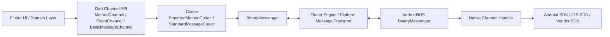
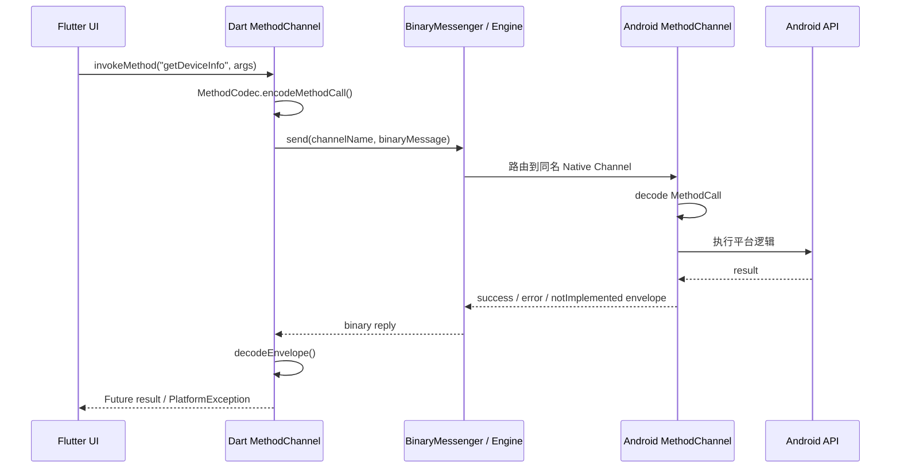
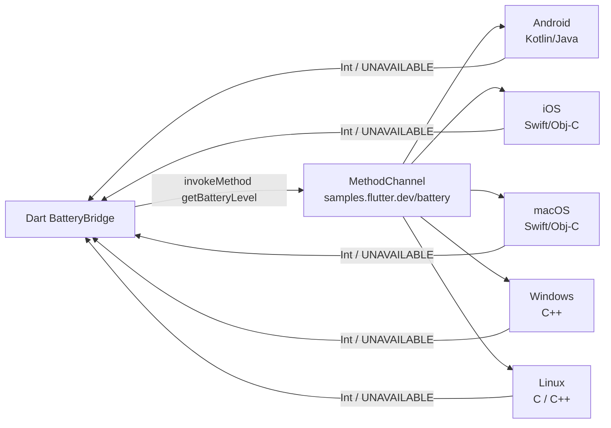
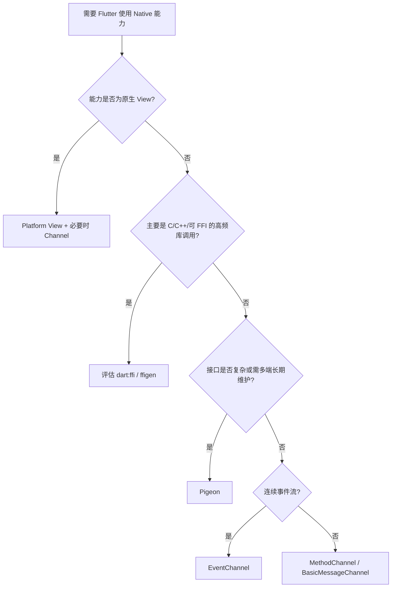

# Flutter 与 Native 通讯原理详解（全平台版）

> [!info] 文档定位
> 本文面向具备 Flutter 与宿主平台基础的开发者，系统讲解 Flutter 与 Native 通讯的底层模型、三类 Platform Channel、编解码、线程模型，以及 Android、iOS、macOS、Windows、Linux 与 Web 的平台落地方式。

## 目录

- [1. 为什么需要 Flutter 与 Native 通讯](#1-为什么需要-flutter-与-native-通讯)
- [2. 通讯方案全景](#2-通讯方案全景)
- [3. Platform Channel 总体原理](#3-platform-channel-总体原理)
  - [3.1 核心组件](#31-核心组件)
  - [3.2 调用链路](#32-调用链路)
  - [3.3 Channel Name 与路由](#33-channel-name-与路由)
- [4. 三种常用 Channel](#4-三种常用-channel)
  - [4.1 MethodChannel：请求响应式调用](#41-methodchannel请求响应式调用)
  - [4.2 EventChannel：Native 连续事件流](#42-eventchannelnative-连续事件流)
  - [4.3 BasicMessageChannel：双向消息通道](#43-basicmessagechannel双向消息通道)
- [5. 编解码与支持的数据类型](#5-编解码与支持的数据类型)
- [6. MethodChannel 完整实战：获取设备信息](#6-methodchannel-完整实战获取设备信息)
  - [6.1 Dart 侧封装](#61-dart-侧封装)
  - [6.2 Android Kotlin 实现](#62-android-kotlin-实现)
  - [6.3 iOS Swift 实现](#63-ios-swift-实现)
  - [6.4 异常处理契约](#64-异常处理契约)
- [7. Native 主动调用 Flutter](#7-native-主动调用-flutter)
- [8. EventChannel 完整实战：电量变化事件](#8-eventchannel-完整实战电量变化事件)
- [9. BasicMessageChannel 使用场景与示例](#9-basicmessagechannel-使用场景与示例)
- [9A. 全平台落地：Android / iOS / macOS / Windows / Linux / Web](#9a-全平台落地android--ios--macos--windows--linux--web)
- [10. 线程、Isolate 与生命周期](#10-线程isolate-与生命周期)
- [11. 插件架构与 Add-to-App 中的通信](#11-插件架构与-add-to-app-中的通信)
- [12. Pigeon：类型安全的工程化桥接](#12-pigeon类型安全的工程化桥接)
- [13. Platform Channel、Pigeon、FFI 与 Platform View 对比](#13-platform-channelpigeonffi-与-platform-view-对比)
- [14. 性能优化与稳定性设计](#14-性能优化与稳定性设计)
- [15. 常见问题与排查清单](#15-常见问题与排查清单)
- [16. 推荐的项目分层](#16-推荐的项目分层)
- [17. 面试与原理问答](#17-面试与原理问答)
- [18. 总结](#18-总结)
- [参考资料](#参考资料)

---

## 1. 为什么需要 Flutter 与 Native 通讯

Flutter UI 与大部分业务逻辑运行在 Dart 侧，但真实应用经常需要复用或调用宿主平台能力，例如：

- Android/iOS 原生 SDK：支付、地图、推送、认证、音视频、美颜、厂商硬件能力；
- 操作系统 API：蓝牙、定位、传感器、电量、相册、文件、通知、剪贴板；
- 已存在的业务组件：公司沉淀的 Kotlin/Swift SDK；
- 原生 UI 容器：地图 View、播放器 View、相机预览等。

Flutter 不能直接将任意 Dart 对象作为 Kotlin/Swift 对象执行；跨运行时边界必须通过明确的互操作机制进行数据交换或函数调用。对于 Android/iOS 平台 API 调用，最典型的机制是 **Platform Channel**。

> [!tip] 先判断是否需要自研通信层
> 对于相机、定位、权限等成熟通用能力，优先评估官方或高质量社区插件；只有现有插件无法满足 SDK、功能或治理要求时，再编写自定义 Platform Channel 或插件。

---

## 2. 通讯方案全景

Flutter 与 Native 交互不只有一种方案：

| 方案 | 通讯对象 | 主要用途 | 典型例子 |
| --- | --- | --- | --- |
| `MethodChannel` | Dart ↔ Kotlin/Swift 等 | 一次请求、一次结果 | 获取电量、调起支付、调用登录 SDK |
| `EventChannel` | Native → Dart 事件流 | 连续事件订阅 | 定位更新、传感器、播放进度 |
| `BasicMessageChannel` | Dart ↔ Native 消息 | 自定义协议、双向消息 | WebView 宿主消息、复杂桥接总线 |
| `Pigeon` | 基于 Platform Channel 的生成式桥接 | 类型安全、多接口工程化 | 大型插件、Native SDK 封装 |
| `dart:ffi` / `ffigen` | Dart ↔ C ABI / Objective-C 等 | 高性能 native library 调用 | 算法库、图像处理、C/C++ 库 |
| Platform View | Flutter UI ↔ 原生 View | 嵌入真实原生视图 | 地图、相机 Preview、原生广告 View |

> [!warning] 概念边界
> Platform View 解决的是“显示并组合原生视图”，Platform Channel 解决的是“跨边界传递消息或调用能力”。两者常在地图、播放器场景同时出现，但并非同一机制。

---

## 3. Platform Channel 总体原理

### 3.1 核心组件

Platform Channel 本质上是一个**具名的异步消息通道**。Flutter 框架在 Dart 与宿主平台之间提供二进制消息传输能力，上层 Channel 再基于编解码器把“方法调用”“事件流”或“普通消息”抽象出来。



| 组件 | 所在层级 | 职责 |
| --- | --- | --- |
| `MethodChannel` / `EventChannel` / `BasicMessageChannel` | Dart 与 Native API 层 | 提供业务可使用的通讯抽象 |
| `MethodCodec` / `MessageCodec` | 编解码层 | 在 Dart 值与二进制载荷之间转换 |
| `BinaryMessenger` | 传输层 | 按 channel name 发送二进制数据、注册接收 handler |
| Flutter Engine / Embedder | 引擎与宿主连接层 | 在 Dart Runtime 与 Android/iOS 之间转发平台消息 |
| Native Handler | Kotlin/Swift 业务接入层 | 调用平台 API，并返回结果或推送事件 |

### 3.2 调用链路

以 Flutter 调用 Android `getDeviceInfo` 为例：



关键结论：

1. Channel 传递的不是共享对象引用，而是经过 codec 编码后的二进制消息。
2. 调用为异步模式，Dart 侧通常表现为 `Future<T?>` 或 `Stream<T>`。
3. 业务代码与 Native handler 必须共同约定 channel name、method name、参数结构、返回结构和错误码。

### 3.3 Channel Name 与路由

Channel name 是逻辑地址，例如：

```dart
static const MethodChannel _channel =
    MethodChannel('com.example.device/device_info');
```

Native 侧必须创建**相同 name** 的 Channel，消息才能匹配到对应 handler。

```kotlin
MethodChannel(binding.binaryMessenger, "com.example.device/device_info")
```

> [!caution] Channel 命名冲突
> 同名 channel 会相互干扰。实际项目中应采用反向域名 + 模块 + 能力的规则，例如 `com.company.app/payment`、`com.company.app/location/events`，禁止使用 `test`、`bridge` 这类泛化短名。

---

## 4. 三种常用 Channel

### 4.1 MethodChannel：请求响应式调用

`MethodChannel` 适用于“调用 Native 方法并得到一次结果”的 RPC 风格场景。

```dart
final result = await channel.invokeMethod<int>('getBatteryLevel');
```

| 特征 | 说明 |
| --- | --- |
| 通讯形态 | 请求 → 响应 |
| Dart 返回形式 | `Future<T?>` |
| 结果类型 | `success`、`error`、`notImplemented` |
| 适用场景 | 权限检查、一次性查询、打开原生页面、调用 SDK 方法 |
| 不适用场景 | 高频持续数据流，如陀螺仪、下载进度事件 |

Flutter 框架提供的内建 `MethodChannel` 保证调用按发送顺序 FIFO 到达插件处理侧，但这不等同于业务异步任务一定按完成顺序返回；并行任务仍应自行设计请求 ID 或状态机。

### 4.2 EventChannel：Native 连续事件流

`EventChannel` 用于向 Flutter 暴露 native event stream：

```dart
final Stream<int> batteryEvents =
    const EventChannel('com.example.device/battery_events')
        .receiveBroadcastStream()
        .cast<int>();
```

Native 侧一般实现两个生命周期回调：

| 回调 | 触发时机 | 处理内容 |
| --- | --- | --- |
| `onListen` | Dart 开始订阅 | 注册监听器、启动传感器、保存 `EventSink` |
| `onCancel` | Dart 取消订阅 | 反注册监听器、释放资源、清空 `EventSink` |

适合的事件：位置更新、蓝牙状态、音频播放状态、网络状态、扫码结果、传感器事件。

### 4.3 BasicMessageChannel：双向消息通道

`BasicMessageChannel<T>` 是更通用的异步消息抽象，不内置“方法名/结果 envelope”或“订阅事件”语义。

```dart
const BasicMessageChannel<Object?> messageChannel = BasicMessageChannel<Object?>(
  'com.example.app/messages',
  StandardMessageCodec(),
);

final Object? reply = await messageChannel.send({
  'type': 'pageVisible',
  'payload': {'pageId': 'home'},
});
```

| 适合使用 `BasicMessageChannel` 的情形 | 不建议使用的情形 |
| --- | --- |
| 自建消息协议或消息总线 | 明确的一次性 API 调用，优先 `MethodChannel` |
| 双端均需要主动发送消息 | 单向连续流，优先 `EventChannel` |
| 使用自定义 `MessageCodec` | 接口数量大且需类型安全，优先 `Pigeon` |

---

## 5. 编解码与支持的数据类型

Channel 不能透明传递任意 Dart/Kotlin/Swift 对象。双方必须使用兼容 codec，并传递 codec 支持的结构。

### 常见 Codec 对比

| Codec | 用于 | 特点 | 建议 |
| --- | --- | --- | --- |
| `StandardMessageCodec` | `BasicMessageChannel` 或底层 value 编码 | Flutter 标准二进制编码，支持常用标量、数组、List、Map | 默认优先 |
| `StandardMethodCodec` | `MethodChannel`、`EventChannel` | 基于标准二进制编码封装 method call / result envelope | 默认优先 |
| `JSONMessageCodec` / `JSONMethodCodec` | 消息或方法通信 | 可读性更好，表达能力和效率有限 | 与外部 JSON 协议一致时使用 |
| `BinaryCodec` | 原始二进制消息 | 不再处理业务对象结构 | 图片片段、已编码数据或自定义协议 |
| `StringCodec` | 字符串消息 | 仅字符串 | 极简协议 |

### `StandardMessageCodec` 典型支持值

| Dart 数据 | Android 对应概念 | iOS 对应概念 | 示例 |
| --- | --- | --- | --- |
| `null` | `null` | `nil` / `NSNull` 语义 | `null` |
| `bool` | `Boolean` | `NSNumber` Bool | `true` |
| `int` / `double` | `Int` / `Long` / `Double` | `NSNumber` | `1024`, `3.14` |
| `String` | `String` | `String` | `'deviceId'` |
| `Uint8List` 等 typed list | primitive array | typed data | 二进制缓冲 |
| `List<Object?>` | `List` | `Array` | `[1, 'a']` |
| `Map<Object?, Object?>` | `Map` | `Dictionary` | `{'code': 0}` |

> [!warning] DTO 传输陷阱
> 自定义 Dart class、Kotlin data class、Swift struct 不能直接经标准 codec 传递。手写 channel 时应序列化为 `Map<String, Object?>`；大型接口则推荐使用 Pigeon 生成数据模型和桥接代码。

### 方法契约建议

不要让方法参数和返回值成为“无约束 Map”。应明确约定：

```text
channel: com.company.app/device
method: getDeviceInfo
arguments: null
success result:
{
  "platform": "android" | "ios",
  "version": String,
  "model": String
}
error:
{
  code: "UNAVAILABLE" | "PERMISSION_DENIED" | "INTERNAL_ERROR",
  message: String,
  details: Map?
}
```

---

## 6. MethodChannel 完整实战：获取设备信息

以下示例演示 Flutter 向 Android/iOS 调用平台能力，获取简化的设备信息。

### 6.1 Dart 侧封装

建议将 Channel 隔离在 data source 或 platform adapter 中，不让 UI 直接持有调用字符串。

#### `getDeviceInfo` 接口参数表

| 项目 | 类型 | 必填 | 说明 |
| --- | --- | --- | --- |
| Channel Name | `String` | 是 | `com.example.app/device`，Dart 与 Native 必须一致 |
| Method Name | `String` | 是 | `getDeviceInfo` |
| Arguments | `null` | 否 | 示例不需要入参；真实项目可加入 `traceId` |
| Result `platform` | `String` | 是 | `android` 或 `ios` |
| Result `version` | `String` | 是 | 系统版本字符串 |
| Result `model` | `String` | 是 | 设备型号描述 |
| Error `code` | `String` | 失败时是 | 稳定机器可读错误码 |
| Error `message` | `String?` | 否 | 面向日志或展示的错误说明 |
| Error `details` | `Object?` | 否 | 原生错误详情或 trace 信息 |

```dart
import 'package:flutter/services.dart';

class DeviceInfo {
  const DeviceInfo({
    required this.platform,
    required this.version,
    required this.model,
  });

  final String platform;
  final String version;
  final String model;

  factory DeviceInfo.fromMap(Map<Object?, Object?> map) {
    return DeviceInfo(
      platform: map['platform'] as String? ?? 'unknown',
      version: map['version'] as String? ?? 'unknown',
      model: map['model'] as String? ?? 'unknown',
    );
  }
}

class DevicePlatformDataSource {
  static const MethodChannel _channel =
      MethodChannel('com.example.app/device');

  Future<DeviceInfo> getDeviceInfo() async {
    try {
      final Map<Object?, Object?>? result =
          await _channel.invokeMapMethod<Object?, Object?>('getDeviceInfo');
      if (result == null) {
        throw const DevicePlatformException('EMPTY_RESULT', 'Native 返回为空');
      }
      return DeviceInfo.fromMap(result);
    } on PlatformException catch (error) {
      throw DevicePlatformException(
        error.code,
        error.message ?? '平台调用失败',
        details: error.details,
      );
    } on MissingPluginException {
      throw const DevicePlatformException(
        'MISSING_PLUGIN',
        '当前平台未注册 getDeviceInfo 实现',
      );
    }
  }
}

class DevicePlatformException implements Exception {
  const DevicePlatformException(this.code, this.message, {this.details});

  final String code;
  final String message;
  final Object? details;

  @override
  String toString() => 'DevicePlatformException($code, $message, $details)';
}
```

调用：

```dart
final deviceInfo = await DevicePlatformDataSource().getDeviceInfo();
print('${deviceInfo.platform} ${deviceInfo.version} ${deviceInfo.model}');
```

### 6.2 Android Kotlin 实现

在普通 Flutter App 中可在 `MainActivity.configureFlutterEngine` 中注册；在可复用插件中，应在 `FlutterPlugin.onAttachedToEngine` 内注册。

```kotlin
package com.example.app

import android.os.Build
import io.flutter.embedding.android.FlutterActivity
import io.flutter.embedding.engine.FlutterEngine
import io.flutter.plugin.common.MethodChannel

class MainActivity : FlutterActivity() {
    private val channelName = "com.example.app/device"

    override fun configureFlutterEngine(flutterEngine: FlutterEngine) {
        super.configureFlutterEngine(flutterEngine)

        MethodChannel(
            flutterEngine.dartExecutor.binaryMessenger,
            channelName
        ).setMethodCallHandler { call, result ->
            when (call.method) {
                "getDeviceInfo" -> {
                    result.success(
                        mapOf(
                            "platform" to "android",
                            "version" to Build.VERSION.RELEASE,
                            "model" to Build.MODEL
                        )
                    )
                }

                else -> result.notImplemented()
            }
        }
    }
}
```

插件化注册方式：

```kotlin
class DevicePlugin : FlutterPlugin, MethodChannel.MethodCallHandler {
    private lateinit var channel: MethodChannel

    override fun onAttachedToEngine(binding: FlutterPlugin.FlutterPluginBinding) {
        channel = MethodChannel(binding.binaryMessenger, "com.example.app/device")
        channel.setMethodCallHandler(this)
    }

    override fun onMethodCall(call: MethodCall, result: MethodChannel.Result) {
        when (call.method) {
            "getDeviceInfo" -> result.success(
                mapOf(
                    "platform" to "android",
                    "version" to Build.VERSION.RELEASE,
                    "model" to Build.MODEL
                )
            )
            else -> result.notImplemented()
        }
    }

    override fun onDetachedFromEngine(binding: FlutterPlugin.FlutterPluginBinding) {
        channel.setMethodCallHandler(null)
    }
}
```

### 6.3 iOS Swift 实现

App 内实现可以注册在 `AppDelegate`：

```swift
import Flutter
import UIKit

@main
@objc class AppDelegate: FlutterAppDelegate, FlutterImplicitEngineDelegate {
    override func application(
        _ application: UIApplication,
        didFinishLaunchingWithOptions launchOptions: [UIApplication.LaunchOptionsKey: Any]?
    ) -> Bool {
        return super.application(application, didFinishLaunchingWithOptions: launchOptions)
    }
    
    func didInitializeImplicitFlutterEngine(_ engineBridge: FlutterImplicitEngineBridge) {
        GeneratedPluginRegistrant.register(with: engineBridge.pluginRegistry)
    
        let channel = FlutterMethodChannel(
            name: "com.example.app/device",
            binaryMessenger: engineBridge.applicationRegistrar.messenger()
        )
        
        channel.setMethodCallHandler { call, result in
            switch call.method {
            case "getDeviceInfo":
                result([
                    "platform": "ios",
                    "version": UIDevice.current.systemVersion,
                    "model": UIDevice.current.model
                ])
            default:
                result(FlutterMethodNotImplemented)
            }
        }
    }
}

```

插件化 Swift 结构：

```swift
import Flutter
import UIKit

public final class DevicePlugin: NSObject, FlutterPlugin {
  public static func register(with registrar: FlutterPluginRegistrar) {
    let channel = FlutterMethodChannel(
      name: "com.example.app/device",
      binaryMessenger: registrar.messenger()
    )
    let instance = DevicePlugin()
    registrar.addMethodCallDelegate(instance, channel: channel)
  }

  public func handle(_ call: FlutterMethodCall, result: @escaping FlutterResult) {
    switch call.method {
    case "getDeviceInfo":
      result([
        "platform": "ios",
        "version": UIDevice.current.systemVersion,
        "model": UIDevice.current.model
      ])
    default:
      result(FlutterMethodNotImplemented)
    }
  }
}
```

### 6.4 异常处理契约

Native 应区分三类返回：

| Native 返回 | Dart 侧表现 | 使用条件 |
| --- | --- | --- |
| `result.success(value)` / `result(value)` | `Future` 正常完成 | 调用成功，即使值为 `null` |
| `result.error(code, message, details)` / `FlutterError(...)` | 抛出 `PlatformException` | 能力存在但执行失败 |
| `result.notImplemented()` / `FlutterMethodNotImplemented` | 抛出 `MissingPluginException` 或对应未实现语义 | method 或平台实现不存在 |

Android 错误示例：

```kotlin
result.error(
    "PERMISSION_DENIED",
    "读取设备标识需要权限",
    mapOf("permission" to "READ_PHONE_STATE")
)
```

iOS 错误示例：

```swift
result(FlutterError(
  code: "UNAVAILABLE",
  message: "设备信息不可用",
  details: nil
))
```

---

## 7. Native 主动调用 Flutter

`MethodChannel` 也是双向可调用的：Native 可通过同名 channel `invokeMethod` 主动通知 Flutter，例如 Native 登录页完成回调、原生播放器状态变化或 SDK 异步结果。

### Dart 接收 Native 调用

```dart
class NativeCallbackBridge {
  static const MethodChannel _channel =
      MethodChannel('com.example.app/callback');

  void start() {
    _channel.setMethodCallHandler((MethodCall call) async {
      switch (call.method) {
        case 'onLoginCompleted':
          final args = Map<Object?, Object?>.from(call.arguments as Map);
          final token = args['token'] as String?;
          // 分发到业务状态层，而不是在 bridge 中直接更新复杂 UI。
          return token != null;
        default:
          throw MissingPluginException('Unknown callback: ${call.method}');
      }
    });
  }

  void dispose() {
    _channel.setMethodCallHandler(null);
  }
}
```

### Android 发起调用

```kotlin
private lateinit var callbackChannel: MethodChannel

callbackChannel = MethodChannel(
    flutterEngine.dartExecutor.binaryMessenger,
    "com.example.app/callback"
)

callbackChannel.invokeMethod(
    "onLoginCompleted",
    mapOf("token" to "token-value")
)
```

### iOS 发起调用

```swift
let callbackChannel = FlutterMethodChannel(
  name: "com.example.app/callback",
  binaryMessenger: controller.binaryMessenger
)

callbackChannel.invokeMethod(
  "onLoginCompleted",
  arguments: ["token": "token-value"]
)
```

> [!warning] 事件语义不要滥用 MethodChannel 回调
> 当 Native 会持续产生大量事件，使用 Native 主动多次 `invokeMethod` 会使订阅和资源释放协议分散。此类场景优先使用 `EventChannel` 暴露 `Stream`。

---

## 8. EventChannel 完整实战：电量变化事件

### Dart 侧

```dart
import 'package:flutter/services.dart';

class BatteryEventSource {
  static const EventChannel _channel =
      EventChannel('com.example.app/battery_events');

  Stream<int> watchBatteryLevel() {
    return _channel.receiveBroadcastStream().map((event) => event as int);
  }
}
```

### Android Kotlin 侧

```kotlin
class BatteryEventPlugin : FlutterPlugin, EventChannel.StreamHandler {
    private lateinit var eventChannel: EventChannel
    private var context: Context? = null
    private var receiver: BroadcastReceiver? = null

    override fun onAttachedToEngine(binding: FlutterPlugin.FlutterPluginBinding) {
        context = binding.applicationContext
        eventChannel = EventChannel(binding.binaryMessenger, "com.example.app/battery_events")
        eventChannel.setStreamHandler(this)
    }

    override fun onListen(arguments: Any?, events: EventChannel.EventSink) {
        val appContext = context ?: return
        receiver = object : BroadcastReceiver() {
            override fun onReceive(context: Context, intent: Intent) {
                val level = intent.getIntExtra(BatteryManager.EXTRA_LEVEL, -1)
                val scale = intent.getIntExtra(BatteryManager.EXTRA_SCALE, -1)
                if (level >= 0 && scale > 0) {
                    events.success(level * 100 / scale)
                }
            }
        }
        appContext.registerReceiver(receiver, IntentFilter(Intent.ACTION_BATTERY_CHANGED))
    }

    override fun onCancel(arguments: Any?) {
        receiver?.let { context?.unregisterReceiver(it) }
        receiver = null
    }

    override fun onDetachedFromEngine(binding: FlutterPlugin.FlutterPluginBinding) {
        onCancel(null)
        eventChannel.setStreamHandler(null)
        context = null
    }
}
```

### iOS Swift 侧结构

```swift
public final class BatteryEventPlugin: NSObject, FlutterPlugin, FlutterStreamHandler {
  private var eventSink: FlutterEventSink?

  public static func register(with registrar: FlutterPluginRegistrar) {
    let channel = FlutterEventChannel(
      name: "com.example.app/battery_events",
      binaryMessenger: registrar.messenger()
    )
    let instance = BatteryEventPlugin()
    channel.setStreamHandler(instance)
  }

  public func onListen(
    withArguments arguments: Any?,
    eventSink events: @escaping FlutterEventSink
  ) -> FlutterError? {
    eventSink = events
    UIDevice.current.isBatteryMonitoringEnabled = true
    NotificationCenter.default.addObserver(
      self,
      selector: #selector(sendBatteryLevel),
      name: UIDevice.batteryLevelDidChangeNotification,
      object: nil
    )
    sendBatteryLevel()
    return nil
  }

  @objc private func sendBatteryLevel() {
    let level = UIDevice.current.batteryLevel
    guard level >= 0 else { return }
    eventSink?(Int(level * 100))
  }

  public func onCancel(withArguments arguments: Any?) -> FlutterError? {
    NotificationCenter.default.removeObserver(self)
    UIDevice.current.isBatteryMonitoringEnabled = false
    eventSink = nil
    return nil
  }
}
```

### 资源释放重点

- `onListen` 注册的 observer、receiver、sensor、delegate 必须在 `onCancel` 释放；
- 页面销毁时取消 Dart `StreamSubscription`；
- 插件 detach 或 engine 销毁时做兜底释放；
- 高频事件应按业务需求节流、采样或仅传状态差量。

---

## 9. BasicMessageChannel 使用场景与示例

BasicMessageChannel 常用于通用消息桥。例如 Native 容器与 Flutter 子页面之间交换路由事件：

### Dart

```dart
import 'package:flutter/services.dart';

class HostMessageBridge {
  static const BasicMessageChannel<Object?> _channel = BasicMessageChannel<Object?>(
    'com.example.app/host_message',
    StandardMessageCodec(),
  );

  Future<void> register() async {
    _channel.setMessageHandler((Object? message) async {
      final map = Map<Object?, Object?>.from(message! as Map);
      switch (map['type']) {
        case 'themeChanged':
          // 处理主题变化。
          return {'accepted': true};
        default:
          return {'accepted': false};
      }
    });
  }

  Future<bool> notifyPageReady(String pageName) async {
    final response = await _channel.send({
      'type': 'pageReady',
      'payload': {'name': pageName},
    });
    return (response as Map<Object?, Object?>?)?['accepted'] == true;
  }
}
```

### Android Kotlin

```kotlin
val channel = BasicMessageChannel<Any>(
    flutterEngine.dartExecutor.binaryMessenger,
    "com.example.app/host_message",
    StandardMessageCodec.INSTANCE
)

channel.setMessageHandler { message, reply ->
    val request = message as? Map<*, *>
    if (request?.get("type") == "pageReady") {
        reply.reply(mapOf("accepted" to true))
    } else {
        reply.reply(mapOf("accepted" to false))
    }
}

channel.send(
    mapOf("type" to "themeChanged", "payload" to mapOf("dark" to true))
)
```

---

## 9A. 全平台落地：Android / iOS / macOS / Windows / Linux / Web

> [!info] 本章定位
> 前文的 Android 与 iOS 章节展示了移动端的业务桥接方式。本章使用官方示例同类的 `getBatteryLevel` 契约，将**相同 Dart API** 分别落地到 Android、iOS、macOS、Windows 与 Linux；Web 则单独说明为何通常不使用宿主 Platform Channel。

### 9A.1 官方平台范围与宿主语言

Flutter 平台通道机制的关键不是宿主语言相同，而是双方遵守相同的 **channel name + method name + codec + 返回契约**。在当前官方平台通道指南中，可直接编写宿主端平台代码的平台如下：

| 目标平台 | 官方文档中对应的宿主实现语言 | 常见宿主入口 | 方法通道类型 | 本章示例能力 |
| --- | --- | --- | --- | --- |
| Android | Kotlin / Java | `MainActivity.configureFlutterEngine` 或 Plugin `onAttachedToEngine` | `MethodChannel` | 电量读取 |
| iOS | Swift / Objective-C | `AppDelegate.didFinishLaunchingWithOptions` 或 Plugin Registrar | `FlutterMethodChannel` | 电量读取 |
| macOS | Objective-C；Runner 示例常用 Swift | `MainFlutterWindow.awakeFromNib` 或 Plugin Registrar | `FlutterMethodChannel` | IOKit 电量读取 |
| Windows | C++ | `FlutterWindow::OnCreate` 或 Plugin 注册函数 | `flutter::MethodChannel<>` | Win32 电量读取 |
| Linux | C / C++ runner | `my_application_activate` 或 Plugin 注册函数 | `FlMethodChannel` | UPower 电量读取 |
| Web | 通常使用 Dart 与 JavaScript 互操作 | Dart web implementation | `dart:js_interop` 等 | Browser API / JS SDK |

> [!warning] Web 的边界
> Flutter Web 运行在浏览器环境，没有 Android/iOS/Desktop 那类宿主 Runner 原生桥接层。Web 插件一般通过 JavaScript interoperability 与浏览器 API 或 JS SDK 交互，而不是照搬移动端 `MethodChannel` 实现。

### 9A.2 跨平台共用的 Dart API

所有 Native 平台只要监听同一个 channel 并实现相同方法，Flutter 业务层就可以保持不变：

```dart
import 'package:flutter/services.dart';

abstract final class BatteryBridge {
  static const MethodChannel _channel =
      MethodChannel('samples.flutter.dev/battery');

  static Future<int?> getBatteryLevel() async {
    try {
      return await _channel.invokeMethod<int>('getBatteryLevel');
    } on PlatformException catch (e) {
      if (e.code == 'UNAVAILABLE') return null;
      rethrow;
    }
  }
}
```

接口契约建议固定如下：

| 项目 | 契约 |
| --- | --- |
| Channel name | `samples.flutter.dev/battery` |
| Method name | `getBatteryLevel` |
| Arguments | 无 |
| Success value | `int`，范围 `0..100` |
| Feature unavailable | `PlatformException(code: "UNAVAILABLE")` |
| Unknown method | `notImplemented` / `FlutterMethodNotImplemented` |



### 9A.3 Android：Kotlin / Java 宿主

**典型位置：** 应用级快速接入可写在 `android/app/src/main/kotlin/.../MainActivity.kt`；可复用能力应放入 Plugin 的 `onAttachedToEngine`。

```kotlin
package com.example.bridge_demo

import android.content.Context
import android.os.BatteryManager
import io.flutter.embedding.android.FlutterActivity
import io.flutter.embedding.engine.FlutterEngine
import io.flutter.plugin.common.MethodChannel

class MainActivity : FlutterActivity() {
    private val channelName = "samples.flutter.dev/battery"

    override fun configureFlutterEngine(flutterEngine: FlutterEngine) {
        super.configureFlutterEngine(flutterEngine)
        MethodChannel(flutterEngine.dartExecutor.binaryMessenger, channelName)
            .setMethodCallHandler { call, result ->
                when (call.method) {
                    "getBatteryLevel" -> {
                        val manager = getSystemService(Context.BATTERY_SERVICE) as BatteryManager
                        val level = manager.getIntProperty(BatteryManager.BATTERY_PROPERTY_CAPACITY)
                        if (level >= 0) result.success(level)
                        else result.error("UNAVAILABLE", "Battery level not available.", null)
                    }
                    else -> result.notImplemented()
                }
            }
    }
}
```

**工程重点：** Android handler 默认与引擎绑定；涉及磁盘、网络、设备 SDK 阻塞调用时，应改用插件中的 `BinaryMessenger.TaskQueue` 运行 handler，并在向 Flutter 发起消息时切回 UI thread。

### 9A.4 iOS：Swift / Objective-C 宿主

**典型位置：** `ios/Runner/AppDelegate.swift`；插件化后在 `register(with registrar:)` 中注册。

```swift
import Flutter
import UIKit

@main
@objc class AppDelegate: FlutterAppDelegate {
  override func application(
    _ application: UIApplication,
    didFinishLaunchingWithOptions launchOptions: [UIApplication.LaunchOptionsKey: Any]?
  ) -> Bool {
    let controller = window?.rootViewController as! FlutterViewController
    let channel = FlutterMethodChannel(
      name: "samples.flutter.dev/battery",
      binaryMessenger: controller.binaryMessenger)

    UIDevice.current.isBatteryMonitoringEnabled = true
    channel.setMethodCallHandler { call, result in
      switch call.method {
      case "getBatteryLevel":
        let level = UIDevice.current.batteryLevel
        if level < 0 {
          result(FlutterError(code: "UNAVAILABLE", message: "Battery level not available.", details: nil))
        } else {
          result(Int(level * 100))
        }
      default:
        result(FlutterMethodNotImplemented)
      }
    }

    GeneratedPluginRegistrant.register(with: self)
    return super.application(application, didFinishLaunchingWithOptions: launchOptions)
  }
}
```

**工程重点：** iOS 平台端向 Flutter 主动发送 channel 消息时必须在 main thread；耗时平台 handler 可使用 Flutter Task Queue，避免把 Native 长任务压在 UI 路径上。

### 9A.5 macOS：Swift / Objective-C 宿主

**典型位置：** `macos/Runner/MainFlutterWindow.swift`。macOS 与 iOS 均使用 `FlutterMethodChannel`，但宿主框架不同：macOS Runner 通过 `FlutterMacOS` 与 `flutterViewController.engine.binaryMessenger` 建立通信。

```swift
import Cocoa
import FlutterMacOS
import IOKit.ps

class MainFlutterWindow: NSWindow {
  override func awakeFromNib() {
    let flutterViewController = FlutterViewController()
    let windowFrame = self.frame
    self.contentViewController = flutterViewController
    self.setFrame(windowFrame, display: true)

    let channel = FlutterMethodChannel(
      name: "samples.flutter.dev/battery",
      binaryMessenger: flutterViewController.engine.binaryMessenger)

    channel.setMethodCallHandler { [weak self] call, result in
      guard call.method == "getBatteryLevel" else {
        result(FlutterMethodNotImplemented)
        return
      }
      guard let level = self?.getBatteryLevel() else {
        result(FlutterError(code: "UNAVAILABLE", message: "Battery level not available.", details: nil))
        return
      }
      result(level)
    }

    RegisterGeneratedPlugins(registry: flutterViewController)
    super.awakeFromNib()
  }

  private func getBatteryLevel() -> Int? {
    let info = IOPSCopyPowerSourcesInfo().takeRetainedValue()
    let sources = IOPSCopyPowerSourcesList(info).takeRetainedValue() as Array
    guard let source = sources.first,
          let description = IOPSGetPowerSourceDescription(info, source)
            .takeUnretainedValue() as? [String: AnyObject],
          let level = description[kIOPSCurrentCapacityKey] as? Int else {
      return nil
    }
    return level
  }
}
```

> [!tip] Apple 双平台复用
> iOS 与 macOS 的 Flutter 通道 API 形态非常接近，但真实系统 API 和权限/entitlement 不同。业务协议可以共享，Native 实现不要直接复制粘贴。

### 9A.6 Windows：C++ 宿主

**典型位置：** `windows/runner/flutter_window.cpp`。Windows Runner 通过 engine 的 messenger 创建 `flutter::MethodChannel<>`，再调用 Win32 API。

```cpp
#include "flutter_window.h"

#include <flutter/method_channel.h>
#include <flutter/standard_method_codec.h>
#include <windows.h>

#include <memory>

static int GetBatteryLevel() {
  SYSTEM_POWER_STATUS status;
  if (GetSystemPowerStatus(&status) == 0 || status.BatteryLifePercent == 255) {
    return -1;
  }
  return status.BatteryLifePercent;
}

bool FlutterWindow::OnCreate() {
  if (!Win32Window::OnCreate()) return false;

  // 创建 flutter_controller_、RegisterPlugins(...) 的模板代码保留不变。
  flutter::MethodChannel<> channel(
      flutter_controller_->engine()->messenger(),
      "samples.flutter.dev/battery",
      &flutter::StandardMethodCodec::GetInstance());

  channel.SetMethodCallHandler(
      [](const flutter::MethodCall<>& call,
         std::unique_ptr<flutter::MethodResult<>> result) {
        if (call.method_name() != "getBatteryLevel") {
          result->NotImplemented();
          return;
        }
        const int level = GetBatteryLevel();
        if (level >= 0) {
          result->Success(level);
        } else {
          result->Error("UNAVAILABLE", "Battery level not available.");
        }
      });

  SetChildContent(flutter_controller_->view()->GetNativeWindow());
  return true;
}
```

> [!warning] 对象生命周期
> 上述片段用于说明官方 Runner 位置与 handler 形态。实际业务中，如果 Channel 需要跨越初始化作用域长期主动发送消息，应将其保存为窗口类或插件对象成员，避免局部对象生命周期不足。

### 9A.7 Linux：C / C++ Runner 与 GLib

**典型位置：** `linux/runner/my_application.cc`。Flutter Linux embedding 采用 GLib/GObject 风格的 `FlMethodChannel`。官方电量示例依赖 UPower 开发头文件，例如 Ubuntu/Debian 可先安装 `libupower-glib-dev`。

```cpp
#include <flutter_linux/flutter_linux.h>
#include <math.h>
#include <upower.h>
#include <cstring>

static FlMethodResponse* get_battery_level() {
  g_autoptr(UpClient) client = up_client_new();
  g_autoptr(GPtrArray) devices = up_client_get_devices2(client);
  if (devices->len == 0) {
    return FL_METHOD_RESPONSE(fl_method_error_response_new(
        "UNAVAILABLE", "Device does not have a battery.", nullptr));
  }
  UpDevice* device = UP_DEVICE(g_ptr_array_index(devices, 0));
  double percentage = 0;
  g_object_get(device, "percentage", &percentage, nullptr);
  g_autoptr(FlValue) value = fl_value_new_int(static_cast<int64_t>(round(percentage)));
  return FL_METHOD_RESPONSE(fl_method_success_response_new(value));
}

static void battery_method_call_handler(FlMethodChannel* channel,
                                        FlMethodCall* call,
                                        gpointer user_data) {
  g_autoptr(FlMethodResponse) response = nullptr;
  if (strcmp(fl_method_call_get_name(call), "getBatteryLevel") == 0) {
    response = get_battery_level();
  } else {
    response = FL_METHOD_RESPONSE(fl_method_not_implemented_response_new());
  }
  g_autoptr(GError) error = nullptr;
  if (!fl_method_call_respond(call, response, &error)) {
    g_warning("Failed to send response: %s", error->message);
  }
}
```

初始化通道时，将其保存在 application 对象中并在释放时清理：

```cpp
// _MyApplication 中增加：FlMethodChannel* battery_channel;

g_autoptr(FlStandardMethodCodec) codec = fl_standard_method_codec_new();
self->battery_channel = fl_method_channel_new(
    fl_engine_get_binary_messenger(fl_view_get_engine(view)),
    "samples.flutter.dev/battery",
    FL_METHOD_CODEC(codec));
fl_method_channel_set_method_call_handler(
    self->battery_channel, battery_method_call_handler, self, nullptr);

// dispose 中：g_clear_object(&self->battery_channel);
```

### 9A.8 Web：使用 JavaScript Interop，而不是复刻宿主 Channel

Web 场景的 Native 通常指浏览器 API 或 JavaScript SDK。例如读取浏览器语言可通过 `dart:js_interop` 暴露 JS 属性：

```dart
@JS()
library;

import 'dart:js_interop';

@JS('navigator.language')
external JSString get _navigatorLanguage;

String get browserLanguage => _navigatorLanguage.toDart;
```

当一个插件要跨端提供统一接口时，可将 web 实现作为平台实现之一注册，在 Dart API 层维持同一抽象：

```dart
abstract interface class PlatformInfoApi {
  Future<String> readEnvironment();
}

// Android/iOS/macOS/Windows/Linux: 通过 Platform Channel 或 Pigeon 实现。
// Web: 通过 dart:js_interop / package:web 实现。
```

### 9A.9 三类 Channel 在各端的 API 对照

| 通信模型 | Dart | Android | iOS / macOS | Windows | Linux | Web 建议 |
| --- | --- | --- | --- | --- | --- | --- |
| 请求-响应 | `MethodChannel` | `MethodChannel` | `FlutterMethodChannel` | `flutter::MethodChannel<>` | `FlMethodChannel` | Dart/JS 函数互操作 |
| 原生连续事件 | `EventChannel` | `EventChannel` | `FlutterEventChannel` | `flutter::EventChannel<>` | `FlEventChannel` | DOM Event / Stream 封装 |
| 自定义双向消息 | `BasicMessageChannel<T>` | `BasicMessageChannel<T>` | `FlutterBasicMessageChannel` | `flutter::BasicMessageChannel<>` | `FlBasicMessageChannel` | JS callback / MessagePort 等 |
| 类型安全 API | Pigeon 生成 Dart/host 桥接 | 生成代码 | 生成代码 | 视 Pigeon 支持范围与版本确认 | 视 Pigeon 支持范围与版本确认 | Dart 平台实现 |

### 9A.10 全平台工程目录建议

```text
lib/
├── platform/
│   ├── battery_api.dart                  # 业务接口
│   ├── battery_channel_impl.dart         # 非 Web 平台 Channel 实现
│   └── battery_web_impl.dart             # Web JS interop 实现
├── domain/
│   └── battery_repository.dart
└── presentation/
    └── battery_page.dart
android/app/src/main/kotlin/.../MainActivity.kt
ios/Runner/AppDelegate.swift
macos/Runner/MainFlutterWindow.swift
windows/runner/flutter_window.cpp
linux/runner/my_application.cc
web/                                      # 必要时提供加载的 JS SDK / 初始化脚本
```

在可复用插件工程中，应将平台实现移入插件目录并以 federated plugin 拆分各端实现；应用层仅依赖 Dart 接口，避免 UI 或业务代码直接拼接 channel method 字符串。

---

## 10. 线程、Isolate 与生命周期

这是平台通信最容易出现线上问题的部分。

### 10.1 线程模型规则

| 方向 / 工作 | 规则 |
| --- | --- |
| Native 发消息到 Flutter | 应在平台主线程发送：Android UI thread / iOS main thread |
| Flutter 发消息到 Native | 根 Isolate 可发送；注册到根 Isolate 的 background Isolate 也可使用插件与 channel |
| Native channel handler 做耗时工作 | 可通过 Task Queue 在后台线程执行，避免阻塞 UI thread |
| 更新原生 UI 或触发要求主线程的 SDK | 切回主线程执行 |

Android 切回 UI thread：

```kotlin
Handler(Looper.getMainLooper()).post {
    channel.invokeMethod("onStateChanged", mapOf("state" to "ready"))
}
```

iOS 切回 main thread：

```swift
DispatchQueue.main.async {
  channel.invokeMethod("onStateChanged", arguments: ["state": "ready"])
}
```

### 10.2 Task Queue：将 Native Handler 放到后台线程

Android 插件示例：

```kotlin
override fun onAttachedToEngine(binding: FlutterPlugin.FlutterPluginBinding) {
    val taskQueue = binding.binaryMessenger.makeBackgroundTaskQueue()
    channel = MethodChannel(
        binding.binaryMessenger,
        "com.example.app/heavy_work",
        StandardMethodCodec.INSTANCE,
        taskQueue
    )
    channel.setMethodCallHandler(this)
}
```

iOS 插件示例：

```swift
public static func register(with registrar: FlutterPluginRegistrar) {
  let taskQueue = registrar.messenger().makeBackgroundTaskQueue?()
  let channel = FlutterMethodChannel(
    name: "com.example.app/heavy_work",
    binaryMessenger: registrar.messenger(),
    codec: FlutterStandardMethodCodec.sharedInstance(),
    taskQueue: taskQueue
  )
  registrar.addMethodCallDelegate(HeavyWorkPlugin(), channel: channel)
}
```

### 10.3 Background Isolate 调用插件

后台 Isolate 使用 channel 前，需要向根 Isolate 注册 messenger：

```dart
import 'dart:isolate';
import 'package:flutter/services.dart';

Future<void> worker(RootIsolateToken token) async {
  BackgroundIsolateBinaryMessenger.ensureInitialized(token);
  const channel = MethodChannel('com.example.app/device');
  final result = await channel.invokeMethod<Object?>('getDeviceInfo');
  print(result);
}

void startWorker() {
  final token = RootIsolateToken.instance!;
  Isolate.spawn(worker, token);
}
```

> [!caution] 主线程与后台执行不是性能万能药
> Task Queue 适合 Native 侧耗时计算或阻塞 I/O，但涉及 Activity、UIView、系统授权弹窗或强制要求主线程的三方 SDK 时，必须遵守对应线程约束；否则会导致崩溃、丢消息或未定义行为。

### 10.4 生命周期管理

| 生命周期阶段 | 必做事项 |
| --- | --- |
| Engine attach / plugin register | 创建 channel、注册 handler |
| 页面订阅开始 | 建立 EventChannel 订阅、注册 Native listener |
| 页面订阅结束 | 取消 `StreamSubscription`，Native 释放监听资源 |
| Engine detach | `setMethodCallHandler(null)` / `setStreamHandler(null)`，释放引用 |
| Activity 重建、权限回调、外部页面返回 | 通过 `ActivityAware` 或业务状态层维护上下文与回调完整性 |

---

## 11. 插件架构与 Add-to-App 中的通信

### 11.1 App 内部快速接入 vs Plugin 化

| 方式 | 注册位置 | 适合场景 | 风险 |
| --- | --- | --- | --- |
| App 内实现 | Android `MainActivity` / iOS `AppDelegate` | 少量项目私有能力、快速验证 | 与宿主强耦合、难复用测试 |
| Plugin 实现 | `FlutterPlugin` / `FlutterPluginRegistrar` | 多模块、可复用 SDK、正式工程 | 初期结构稍复杂 |
| Federated Plugin | platform interface + 多平台实现 | 对外发布、多平台扩展 | 治理和版本成本更高 |

### 11.2 Add-to-App 的注意点

将 Flutter 作为模块嵌入已有 Native App 时：

- 通信绑定于具体 `FlutterEngine` 的 `binaryMessenger`；
- 多 FlutterEngine / 缓存 Engine 场景下，禁止误将某个 engine 的 channel 当作全局唯一通道；
- Native 页面展示 Flutter 前即可向其对应 engine 注册插件与 channel；
- 销毁 engine 或模块不再需要时，应移除监听并释放与页面/Activity/ViewController 的强引用。

---

## 12. Pigeon：类型安全的工程化桥接

手写 `MethodChannel` 的主要痛点包括：

- channel name 与 method name 依赖字符串，易拼写错误；
- `dynamic`、`Map` 类型转换错误只能运行时暴露；
- Android、iOS、Dart 多端接口演进易不一致；
- 大量 DTO、回调与错误处理模板代码重复。

`Pigeon` 是 Flutter 官方发布的代码生成工具：在 Dart 定义消息模型和 Host/Flutter API，再生成 Dart、Kotlin/Java、Swift/Objective-C 等桥接代码，实现类型更明确的 Platform Channel 通讯。

### 12.1 Pigeon API 定义示意

```dart
import 'package:pigeon/pigeon.dart';

class DeviceRequest {
  String? traceId;
}

class DeviceReply {
  String? platform;
  String? version;
  String? model;
}

@HostApi()
abstract class DeviceHostApi {
  DeviceReply getDeviceInfo(DeviceRequest request);
}

@FlutterApi()
abstract class DeviceFlutterApi {
  void onDeviceStateChanged(String state);
}
```

含义：

| 注解 | 调用方向 | 作用 |
| --- | --- | --- |
| `@HostApi()` | Flutter → Native | Flutter 调用宿主实现 |
| `@FlutterApi()` | Native → Flutter | Native 回调 Flutter 实现 |

### 12.2 使用建议

| 项目情况 | 建议 |
| --- | --- |
| 仅 1～2 个简单 API，内部使用 | 手写 `MethodChannel` 足够清晰 |
| 多个 Native SDK、复杂 DTO、多端共同维护 | 优先 Pigeon |
| 插件作为产品长期发布 | Pigeon + 明确版本/兼容性策略 |
| 极高频、重二进制或 C/C++ 算法调用 | 评估 FFI，而非扩大 channel 负载 |

> [!tip] Pigeon 的价值重点
> Pigeon 解决的重点是接口治理、类型安全与生成代码，不是把“跨边界通信”变成零成本调用；底层仍属于平台互操作边界，应继续控制调用粒度和数据规模。

---

## 13. Platform Channel、Pigeon、FFI 与 Platform View 对比

| 维度 | 手写 Platform Channel | Pigeon | `dart:ffi` / `ffigen` | Platform View |
| --- | --- | --- | --- | --- |
| 核心目标 | 消息与方法调用 | 类型安全的 channel API | 调用 native library / C ABI 等 | 嵌入原生 UI |
| 类型安全 | 较弱，运行时转换 | 较强，生成接口 | 强但需处理 native 类型和内存 | 与数据调用无直接关系 |
| 调用频率适应性 | 中低频更合适 | 中低频、复杂 API | 高频计算/库调用更适合 | 面向视图合成 |
| Android 系统 Java/Kotlin API | 直接适合 | 直接适合 | 通常不如 channel 直接 | 不适用 |
| iOS SDK / Swift API | 直接适合 | 直接适合 | 可结合 Objective-C/Swift interop | 不适用 |
| 开发复杂度 | 低至中 | 中 | 中至高 | 中至高 |
| 推荐场景 | 小型桥接 | 正式 SDK 插件/大型桥接 | 算法库、C/C++、高吞吐调用 | 地图/播放器/原生视图 |

### 决策流程



---

## 14. 性能优化与稳定性设计

Platform Channel 涉及跨运行时边界、编解码和线程切换。它适合控制命令和中等规模数据交换，不适合作为无节制高吞吐数据总线。

### 14.1 性能问题来源

| 问题 | 原因 | 优化策略 |
| --- | --- | --- |
| 首帧或交互卡顿 | Native handler 在主线程做阻塞工作 | Task Queue / 后台执行，结果再回主线程 |
| 高频事件导致 Dart 压力 | 定位/传感器/播放进度推送过密 | 采样、节流、批处理、按页面可见性订阅 |
| 大对象传输耗时 | Map/List 层层编码与复制 | 缩小 DTO；二进制场景考虑 typed data、FFI 或文件共享策略 |
| 字符串契约错误 | method/key 分散维护 | 集中常量、封装 adapter，复杂场景 Pigeon |
| 内存泄漏 | Event listener、context、controller 未释放 | 完整处理 cancel/detach/dispose |

### 14.2 API 设计原则

1. **粗粒度 API**：调用 `startPayment(request)`，而非把支付流程拆成大量细碎 channel 往返。
2. **DTO 小而稳定**：只传业务确实需要的数据，避免把原生 SDK 全对象转成 Map。
3. **明确错误码**：以稳定 code 驱动业务逻辑，以 message 供日志和展示参考。
4. **可取消订阅**：流式能力必须支持停止监听、页面退出与 engine detach。
5. **加 traceId**：支付、上传、认证等异步链路建议带 request/trace ID 便于日志串联。
6. **版本兼容**：插件 API 变更应兼容旧字段或提供清晰升级策略。

### 14.3 安全与隐私

- 不要在 channel 日志中明文打印 token、证件号、支付参数或用户敏感信息；
- Native 回传 Flutter 的 URI、路径、深链参数应做校验；
- WebView、支付、登录等跨层回调应校验来源与状态，避免仅凭一条 channel 消息改变认证状态；
- 调试日志在 release 环境应降级或关闭。

---

## 15. 常见问题与排查清单

### 15.1 `MissingPluginException`

| 可能原因 | 排查方式 |
| --- | --- |
| Native 未注册对应 channel | 检查注册代码是否执行，channel name 是否一致 |
| method name 不一致 | 对照 Dart 与 Native 字符串 |
| 热重载后 Native 注册未生效 | 完整重新运行应用 |
| 单元测试环境无 native plugin | mock `BinaryMessenger` 或在 adapter 层注入实现 |
| 仅某平台实现 | 调用前做平台能力判断或返回明确不支持错误 |

### 15.2 `PlatformException`

| 排查维度 | 内容 |
| --- | --- |
| `code` | 应作为稳定业务分类依据，例如 `PERMISSION_DENIED` |
| `message` | 辅助定位，避免业务仅依赖可变化文案 |
| `details` | 携带原生错误码、traceId、缺失权限等结构化信息 |
| Native 日志 | 检查 SDK 原始异常与调用线程 |

### 15.3 类型转换异常

常见错误：Native 返回了 `Map`，Dart 直接写成 `Map<String, String>` 强制转换；其中值可能不是 String 或 codec 解码后 map 泛型为 `Object?`。

```dart
// 推荐：先接 Object? Map，再自行验证字段。
final Map<Object?, Object?>? raw =
    await channel.invokeMapMethod<Object?, Object?>('getDeviceInfo');
```

### 15.4 Native → Flutter 线程错误

现象可能包括日志提示平台消息从非 platform thread 发送、消息丢失或崩溃风险。排查点：

- Android 回调是否由后台 executor/thread 直接执行 `invokeMethod`；
- iOS delegate/notification callback 是否在非 main queue 直接调用 channel；
- 将发消息动作调度至 Android UI thread 或 iOS main queue。

### 15.5 EventChannel 重复注册或无法释放

检查：

- Flutter widget 是否重复订阅而未取消旧 `StreamSubscription`；
- Android receiver / sensor listener 是否重复注册；
- iOS `NotificationCenter` observer 是否在 `onCancel` 移除；
- engine detach 时是否已清理 stream handler 和 native 资源。

### 调试清单

```text
[ ] Dart 与 Native channel name 完全一致
[ ] method/event 参数与结果数据类型在 codec 支持范围内
[ ] 所有失败路径均调用 success/error/notImplemented 之一
[ ] Native → Flutter 的消息在平台主线程发送
[ ] 耗时 handler 不阻塞 UI 主线程
[ ] EventChannel 的 onCancel / dispose / detach 可释放资源
[ ] DTO、错误码、日志 traceId 有文档约定
[ ] release 日志不会泄漏敏感数据
```

---

## 16. 推荐的项目分层

不要在 Widget 里直接散落 `invokeMethod('xxx')`。建议将平台通信视为基础设施适配器：

```text
lib/
├── features/
│   └── device/
│       ├── domain/
│       │   ├── device_info.dart
│       │   └── device_repository.dart
│       ├── data/
│       │   ├── device_repository_impl.dart
│       │   └── device_platform_data_source.dart
│       └── presentation/
│           └── device_page.dart
├── platform_bridge/
│   ├── channel_names.dart
│   ├── platform_error.dart
│   └── generated/              # Pigeon 生成代码时使用
android/
└── .../DevicePlugin.kt
ios/
└── Classes/DevicePlugin.swift
```

### 分层职责

| 层 | 职责 |
| --- | --- |
| Presentation | 展示状态，不接触 method 字符串或 native map |
| Domain | 定义业务接口和实体，不感知 Flutter channel |
| Data source / Adapter | 执行 channel 调用、DTO 转换、错误翻译 |
| Native Plugin | 调用系统/SDK API，遵守线程与生命周期 |
| Pigeon Generated | 承载生成式协议与桥接代码，不手工修改 |

### 测试建议

| 测试层次 | 重点 |
| --- | --- |
| Dart 单元测试 | adapter 对成功结果、错误码、空值和类型错误的处理 |
| Flutter 测试 | 使用 mock binary messenger 模拟 channel response |
| Android/iOS 单测 | Native handler 对 SDK 结果和权限错误的映射 |
| 集成测试 | 真机权限、SDK 回调、事件订阅释放、前后台切换 |

---

## 17. 面试与原理问答

### Q1：Flutter 为什么能调用 Native API？

Flutter Engine/Embedder 提供平台消息通道；Dart 侧通过 `BinaryMessenger` 和上层 Channel 将编码后的二进制消息发送给 Android/iOS，Native 同名 handler 解码后执行系统或 SDK 能力，并将结果按协议回传。

### Q2：MethodChannel 与 EventChannel 的区别是什么？

`MethodChannel` 是一次请求对应一次响应的异步方法调用；`EventChannel` 是建立/取消订阅后由 Native 持续向 Dart 推送事件流，Dart 侧表现为 `Stream`。

### Q3：Platform Channel 是共享内存调用吗？

不是。它是跨边界消息通信：参数与结果需要通过 codec 编码为二进制消息后传输，再由另一侧解码。

### Q4：为什么 Channel API 容易出现运行时类型错误？

手写 Channel 的 Dart 参数和结果多为 `dynamic` 或 `Map`，双方依赖人工维护协议；字段类型、method name、channel name 不一致时通常只能运行时暴露。Pigeon 可降低此类问题。

### Q5：高频算法调用为什么考虑 FFI？

Platform Channel 会经历消息包装、编解码和跨边界调度；对于可通过 C ABI 或相关互操作方式暴露的高吞吐 native library，`dart:ffi` 更贴近函数级互操作模型。但 FFI 会带来内存、ABI 与线程治理成本。

### Q6：为什么 Native 回调 Flutter 需要注意主线程？

平台消息要求从对应平台线程安全地发送到 Flutter；Native SDK 的回调可能位于后台线程，必须在发送 channel message 前切回 Android UI thread 或 iOS main thread。

---

## 18. 总结

Flutter 与 Native 通讯的核心并不是“Dart 直接执行 Kotlin/Swift”，而是：

1. 通过**具名 Channel** 建立逻辑通信地址；
2. 通过 **Codec** 将方法、参数、结果或事件编码为二进制消息；
3. 通过 **BinaryMessenger 与 Flutter Engine** 在 Dart Runtime 与宿主平台之间转发消息；
4. 在 Native handler 中真正调用 Android/iOS/三方 SDK 能力；
5. 通过规范的错误、线程、生命周期和类型契约保证工程稳定性。

选型上：一次性业务调用使用 `MethodChannel`；连续事件使用 `EventChannel`；自定义双向消息使用 `BasicMessageChannel`；复杂、长期维护的桥接接口优先 `Pigeon`；高吞吐 native library 场景评估 `dart:ffi`；显示原生 UI 时使用 Platform View，并按需结合 Channel。

---

## 参考资料

- Flutter 官方文档：[Writing custom platform-specific code](https://docs.flutter.dev/platform-integration/platform-channels)
- Flutter 官方文档：[Supported deployment platforms](https://docs.flutter.dev/reference/supported-platforms)
- Dart 官方文档：[JavaScript interoperability](https://dart.dev/interop/js-interop)
- Flutter API：[MethodChannel](https://api.flutter.dev/flutter/services/MethodChannel-class.html)
- Flutter API：[EventChannel](https://api.flutter.dev/flutter/services/EventChannel-class.html)
- Flutter API：[BasicMessageChannel](https://api.flutter.dev/flutter/services/BasicMessageChannel-class.html)
- Flutter API：[BinaryMessenger](https://api.flutter.dev/flutter/services/BinaryMessenger-class.html)
- Flutter API：[StandardMessageCodec](https://api.flutter.dev/flutter/services/StandardMessageCodec-class.html)
- Flutter API：[StandardMethodCodec](https://api.flutter.dev/flutter/services/StandardMethodCodec-class.html)
- Flutter 官方发布包：[Pigeon](https://pub.dev/packages/pigeon)
- Dart 官方文档：[C interop using dart:ffi](https://dart.dev/interop/c-interop)
- Dart 官方文档：[Objective-C and Swift interop using package:ffigen](https://dart.dev/interop/objective-c-interop)

